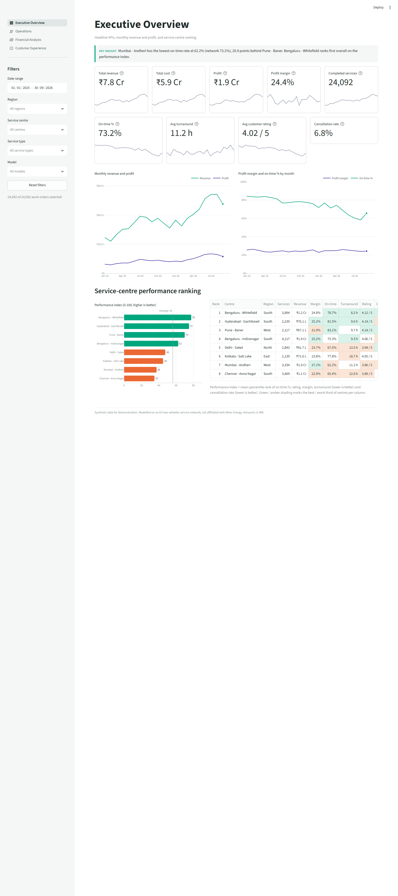
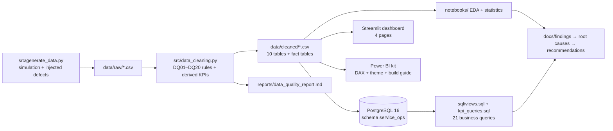
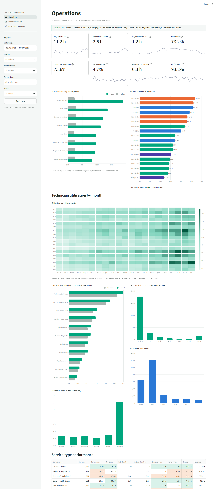
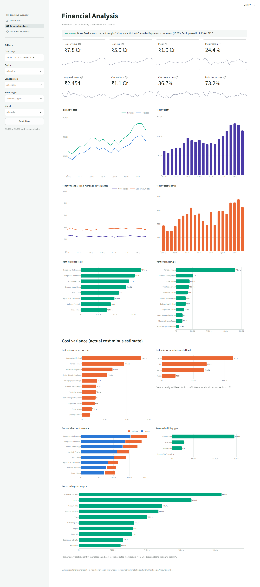
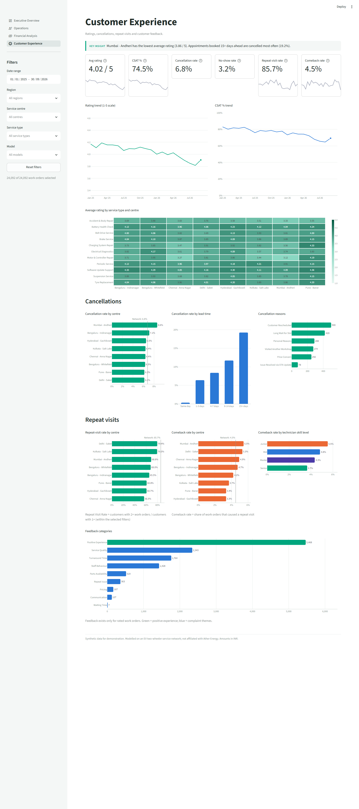

# Vehicle Service Operations Analytics & Process Optimization

An end-to-end analytics engagement for an **EV two-wheeler service network**. Synthetic service data is generated,
cleaned and validated, loaded into PostgreSQL and analysed with SQL and Python, then presented in a dashboard. The
work ends with five data-backed bottlenecks and six prioritised process recommendations.

The network has 8 service centres, 18 technicians and 5,300 scooters (Ather 450X, 450 Apex and Rizta). The data
covers January 2025 to September 2026, with **24,092 work orders** and **26,769 appointments**.

> **Synthetic data only.** The network is modelled on an Ather-style EV scooter service operation for portfolio
> purposes. It is **not affiliated with or derived from Ather Energy**, and there is no real customer data or PII.



---

## The business problem

Management of a multi-centre service network needs to know:

1. How much revenue, cost and profit the network generates, and how performance is trending.
2. Which centres, technicians, vehicle models and service types perform best and worst.
3. Where delays, cancellations, cost overruns and dissatisfaction occur.
4. Which operational factors are associated with poor turnaround.
5. **What process changes to make, backed by evidence.**

## Headline results

| KPI | Value | KPI | Value |
|---|---|---|---|
| Revenue | ₹7.82 Cr | On-time completion | 73.2% |
| Profit / margin | ₹1.91 Cr / 24.4% | Technician utilisation (2026) | 91.5% |
| Avg service cost | ₹2,454 | Cancellation rate | 6.8% |
| Cost overrun rate | 36.7% | Customer rating (CSAT%) | 4.02 / 5 (74.5%) |

**The story:** Jan–Sep 2026 delivered **+47% jobs and +41% revenue** year over year with the **same 18
technicians**. Utilisation rose from 61% to 92%, and on-time completion fell from 81% to 67%.

### Bottlenecks found ([findings](docs/findings.md) · [root causes](docs/root_cause_analysis.md))

| # | Bottleneck | Evidence |
|---|---|---|
| B1 | **Technician capacity** at Mumbai, Chennai and Delhi | 2026 utilisation of 125%, 119% and 102%; on-time of 62–67% vs 83% at the benchmark centres. On-time drops from 89% to 61% once daily load passes 100% of capacity. |
| B2 | **Saturday peak** | Saturday carries 24% of jobs, with a 3.1 h mean wait (0.6 h on weekdays) and 55% on-time. |
| B3 | **Parts availability** at Kolkata, for motor/controller and dashboard parts | Parts-delayed jobs are never on time; median turnaround is 116 h and rating 2.95. Kolkata's delay rate is 11.2%, 2–3× other centres. |
| B4 | **Skill mix** | Juniors run +0.65 h per job over estimate (seniors +0.14 h); cost overrun is 56% vs 27%. Mumbai has no senior technician. |
| B5 | **Booking lead time → cancellations** | Bookings made 15+ days ahead cancel 19.2% of the time, vs 6.4% for 1–3 days. Mumbai has the longest lead time and highest cancellation rate. |

### Recommendations ([full detail, impact and 30/60/90-day roadmap](docs/recommendations.md))

- **R1. Add capacity where utilisation is above 100%.** Add a Senior technician at Mumbai and a Mid technician at Chennai. Projected on-time: Mumbai 55% → 74%, Chennai 57% → 81%.
- **R2. Shape Saturday capacity to demand.** Extend Saturday hours at the four busiest centres and steer bookings to centres with weekday headroom.
- **R3. Make Kolkata parts and promise times parts-aware.** Hold safety stock for 34 SKUs (₹1.77 L one-off), check stock at booking, and set promise times that allow for parts lead time.
- **R4. Use skill as a capacity lever.** Route jobs by skill, coach juniors, and require senior QC sign-off.
- **R5. Control the booking window.** Reconfirm long-lead bookings and release freed slots.
- **R6. Tighten estimates and approvals.** Re-quote when extra work is found, and recalibrate standard labour times.

Every number above is computed by `python -m src.analysis_metrics`. Relationships are reported as associations
and treated as hypotheses to confirm operationally, not as proven causes.

---

## Architecture



| Layer | Tools |
|---|---|
| Data generation, cleaning and EDA | Python 3.11, pandas, NumPy, SciPy, Matplotlib, Seaborn, Jupyter |
| Database and SQL | PostgreSQL 16 (Docker), psycopg 3: joins, CTEs, window functions, views |
| Dashboard | Streamlit + Plotly (runs locally); Power BI kit with 65 DAX measures, theme and page specs |
| Quality | pytest: unit, integration and app smoke tests |

## Quick start

**Prerequisites:** Python 3.11+, and Docker Desktop for the SQL layer.

```bash
# 1. Environment
python -m venv .venv
.venv\Scripts\activate            # Windows  (macOS/Linux: source .venv/bin/activate)
pip install -r requirements-dev.txt   # runtime + tests + notebooks (runtime only: requirements.txt)

# 2. Database credentials: copy the template and set a local password
copy .env.example .env            # macOS/Linux: cp .env.example .env

# 3. Start PostgreSQL
docker compose up -d

# 4. Run the whole pipeline: generate → clean → load DB → SQL reports → analysis metrics
python -m src.pipeline            # add --skip-db to run without Docker

# 5. Launch the dashboard at http://localhost:8501
python -m streamlit run app/streamlit_app.py

# 6. Tests
python -m pytest
```

The pipeline is deterministic (seed 42), so a fresh run reproduces every file and number in this repository.

Individual stages:

| Command | Output |
|---|---|
| `python -m src.generate_data` | `data/raw/*.csv` and `generation_manifest.json` (the injected-defect log) |
| `python -m src.data_cleaning` | `data/cleaned/*.csv`, `reports/data_quality_report.md`, `reports/cleaning_log.csv` |
| `python -m src.load_to_db` | `service_ops` schema: 10 tables plus KPI views |
| `python -m src.run_sql_reports` | `reports/sql_results/` (21 KPI queries, 50 SQL data-quality checks and a summary) |
| `python -m src.analysis_metrics` | `reports/analysis_metrics.json` (every number cited in `docs/`) |

## Dataset

There are 10 normalised tables: `customers`, `vehicles`, `service_centers`, `technicians`, `appointments`,
`work_orders`, `parts`, `part_usage`, `financials` and `feedback`. Four analytical extracts are built from them:
`fact_service`, `fact_appointments`, `fact_technician_month` and `dim_date`. Field definitions are in the
[data dictionary](docs/data_dictionary.md).

The generator **simulates** the operation rather than drawing random numbers, so the patterns in the data have a
cause the analysis can find:

- **Vehicle sales and visits:** 450X, Apex and Rizta sales drive periodic services and repairs. Repair mix varies with season (monsoon), vehicle age, mileage and customer type (fleets).
- **Queueing:** each centre-day has a load, and the queue builds as daily load approaches technician capacity.
- **Labour time:** actual hours depend on technician skill.
- **Parts:** stock-outs vary by part category and regional supply distance.
- **Rework:** quality-check failures lead to 30-day comebacks.
- **Ratings:** respond to lateness, waiting and rework.

About 1% of data-entry defects are then injected and logged: duplicates, mixed date formats, orphan keys, swapped
timestamps, sign and decimal errors, out-of-range ratings and impossible model years. The cleaning pipeline
detects all of them, and the [data-quality report](reports/data_quality_report.md) reconciles detected counts
against the injection log.

## Dashboard

The Streamlit app mirrors the four Power BI pages in the spec. Sidebar filters for date range, region, centre,
service type and model apply to every KPI and chart on every page.

| Executive Overview | Operations |
|---|---|
|  |  |
| **Financial Analysis** | **Customer Experience** |
|  |  |

Power BI Desktop users can rebuild the same report from [`powerbi/README.md`](powerbi/README.md). It covers the
star schema, the DAX measures, the theme, a page-by-page layout and reconciliation values for acceptance testing.

## Repository map

```
├── src/                 generate_data · data_cleaning · load_to_db · run_sql_reports · kpis · analysis_metrics · pipeline
├── sql/                 schema.sql · data_quality.sql · views.sql · kpi_queries.sql · README (ER diagram)
├── notebooks/           01_data_generation · 02_data_quality · 03_exploratory_analysis (executed)
├── app/                 Streamlit dashboard (4 pages, shared filters)
├── powerbi/             DAX measures · theme JSON · build guide
├── docs/                BRD · process map · data dictionary · data lineage · findings · root cause · recommendations
├── reports/             data-quality report · SQL results · analysis metrics · figures/
├── data/raw, cleaned/   generated CSVs (reproducible from seed)
└── tests/               pytest suite (pipeline, KPIs, DB, dashboard smoke tests)
```

## Documentation

| Document | Contents |
|---|---|
| [Business Requirements](docs/business_requirements.md) | Stakeholders, BR/FR/NFR/DR requirements, KPI definitions, risks, acceptance criteria, traceability |
| [Process Map](docs/process_map.md) | The 11-stage service workflow with measured durations, failure points and bottlenecks |
| [Data Dictionary](docs/data_dictionary.md) | Every table and field, ER diagram, enumerations |
| [Data Lineage & Governance](docs/data_lineage.md) | Source-to-dashboard lineage per KPI, missing-data risks, PII and credential policy |
| [Findings](docs/findings.md) | 11 findings with metrics, statistical tests, effect sizes and confidence |
| [Root Cause Analysis](docs/root_cause_analysis.md) | 5 Whys and fishbone for each bottleneck, with confirming-data hypotheses |
| [Recommendations](docs/recommendations.md) | Impact × effort, quantified impact, success KPIs, 30/60/90-day roadmap |
| [Assumptions & Limitations](docs/assumptions_and_limitations.md) | Modelling assumptions and what cannot be concluded |

## Governance

- **Synthetic data only.** IDs are surrogate keys, and there are no names, phones, emails or addresses.
- **No secrets in the repository.** Database credentials come from `.env`, which is gitignored; `.env.example` is the template.
- **Documented rules.** Every KPI definition and cleaning rule is documented and traceable from raw field to dashboard visual.
