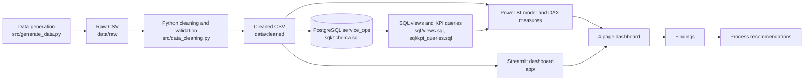

# Business Requirements Document (BRD)

**Vehicle Service Operations Analytics & Process Optimization**

## 0. Document control

| Item | Detail |
|---|---|
| Document title | Business Requirements Document: Vehicle Service Operations Analytics & Process Optimization |
| Version | 1.0 |
| Date | 2026-10-05 |
| Author | Analytics Team |
| Status | Baselined for build and acceptance testing |
| Data cut-off | 2026-09-30 (reporting period 2025-01-01 to 2026-09-30, 21 months) |
| Related documents | [data_dictionary.md](data_dictionary.md), [data_lineage.md](data_lineage.md), [assumptions_and_limitations.md](assumptions_and_limitations.md), [process_map.md](process_map.md), [root_cause_analysis.md](root_cause_analysis.md), [findings.md](findings.md), [recommendations.md](recommendations.md), [../reports/data_quality_report.md](../reports/data_quality_report.md) |

### Revision history

| Version | Date | Author | Change |
|---|---|---|---|
| 0.1 | 2026-09-14 | Analytics Team | Scope and KPI framework drafted from the project specification |
| 0.9 | 2026-09-28 | Analytics Team | Requirements reviewed against the generated dataset and cleaning rules DQ01-DQ20 |
| 1.0 | 2026-10-05 | Analytics Team | Baseline values recomputed from `data/cleaned/`; acceptance criteria finalised |

### Notice on data

All data in this project is **synthetic**. It models an EV two-wheeler service network resembling Ather's scooter range (Ather 450X, Ather 450 Apex, Ather Rizta) for portfolio purposes. It is not Ather Energy data, and the project is not affiliated with or endorsed by Ather Energy. No real customer, vehicle or personal data is used. Baselines and targets in this document describe the synthetic network and must not be read as statements about any real business.

---

## 1. Purpose and executive summary

This document defines what the business needs from the analytics solution and how the solution will be accepted. The solution turns appointment, work-order, technician, parts, cost and feedback data from eight service centres into trusted KPIs, an interactive dashboard (Power BI, mirrored in Streamlit), and evidence-based process recommendations.

The scope covers 26,769 appointments, 24,092 completed work orders, 5,300 vehicles, 3,351 customers, 18 technicians and INR 78.2 million of revenue (excluding GST). The headline operating picture at baseline is below; each figure is defined in section 10.

| Headline (Jan 2025 - Sep 2026) | Value |
|---|---|
| Revenue / cost / profit | INR 78.24 M / INR 59.11 M / INR 19.13 M (margin 24.4%) |
| On-time completion | 73.2% (2025: 79.7%, 2026 YTD: 67.1%) |
| Cancellation rate / no-show rate | 6.8% / 3.2% |
| Average customer rating / CSAT | 4.02 / 74.5% (50.6% of jobs rated) |
| Technician utilisation | 75.6% (68 of 378 technician-months above 100%) |

---

## 2. Business background and problem

### 2.1 Background

The organisation operates eight after-sales service centres in seven Indian cities (Bengaluru x2, Chennai, Hyderabad, Pune, Mumbai, Delhi and Kolkata) across four regions. Centres service three scooter models and are staffed by 18 technicians at four skill grades. Customers are mostly individuals, with a small number of fleet and corporate accounts that generate a large share of visits (fleet accounts are 4% of customers but 48% of work orders).

Operational data lives in separate booking, workshop, parts, billing and survey records. Management reviews performance through ad-hoc extracts, so centre-to-centre comparisons are slow, definitions differ between teams, and process problems surface through customer complaints instead of metrics.

### 2.2 Problem statement

Management cannot currently answer, from one trusted source, the five questions below. The project must answer them with evidence and convert the answers into actionable recommendations, not just charts.

| ID | Management question (spec section 1) | Why it matters |
|---|---|---|
| MQ1 | How much revenue, cost and profit is generated, and how does performance change over time? | Financial health and trend visibility |
| MQ2 | Which service centres, technicians, vehicle categories and service types perform best or worst? | Targeting of coaching and investment |
| MQ3 | Where do delays, cancellations, cost overruns and customer dissatisfaction occur? | Locating the pain points |
| MQ4 | What operational factors are associated with poor turnaround time and service performance? | Prioritising root causes (as hypotheses, not proven causes) |
| MQ5 | What practical process changes should management implement, based on evidence? | Turning analysis into decisions |

### 2.3 Observed symptoms that motivate the work

These are baseline facts computed from the cleaned data, not conclusions. Root causes are examined in [root_cause_analysis.md](root_cause_analysis.md).

| Symptom | Evidence |
|---|---|
| On-time performance is low and falling | 73.2% overall; 79.7% in 2025 vs 67.1% in 2026 YTD |
| Large spread between centres | On-time from 62.2% (Mumbai - Andheri) to 83.1% (Pune - Baner) |
| A small number of jobs dominate delay | 1,134 parts-delayed jobs (4.7%) are never on time, with median turnaround 116 h vs 2.5 h for other jobs |
| Cost estimates are unreliable | 36.7% of jobs cost more than 10% above estimate |
| Demand is lost before service | 1,810 cancellations (6.8%) and 867 no-shows (3.2%) |
| Rework | 4.5% of jobs are followed by a same-vehicle, same-service return within 30 days |
| Customer sentiment is mixed | CSAT 74.5%; Turnaround Time is the largest negative feedback theme (1,764 responses) |

---

## 3. Objectives

| ID | Objective (spec section 2) | Measure of success |
|---|---|---|
| OBJ-01 | Create a realistic synthetic service dataset | At least 10,000 service records generated deterministically (seed 42): 24,092 work orders delivered |
| OBJ-02 | Store and query the data with SQL | Normalised PostgreSQL schema `service_ops`, reusable views and at least 10 analytical queries |
| OBJ-03 | Clean, validate and analyse the data in Python | Rules DQ01-DQ20 applied and logged; data-quality report; EDA notebook |
| OBJ-04 | Calculate operational, financial and customer KPIs | 16 KPIs defined once and reconciled across Python, SQL and BI |
| OBJ-05 | Build an interactive dashboard | 4 pages (Executive, Operations, Financial, Customer) with working slicers |
| OBJ-06 | Perform variance, trend and bottleneck analysis | At least 3 bottlenecks identified with metric evidence |
| OBJ-07 | Identify likely drivers of delay and performance gaps | Driver analysis using hypotheses language; no causal claims from correlation alone |
| OBJ-08 | Recommend measurable process improvements | At least 3 prioritised recommendations, each traced to a metric and carrying an expected impact |
| OBJ-09 | Document requirements, assumptions, definitions, risks and limitations | This BRD, data dictionary, lineage, assumptions and limitations |
| OBJ-10 | Package as a reproducible portfolio project | A reviewer can rebuild the data and KPIs from the README without credentials from the author |

---

## 4. Scope

### 4.1 Solution architecture

### 4.2 In scope

| Area | Included |
|---|---|
| Transactions | Appointments and work orders, including cancelled and no-show bookings |
| Master data | Customers, vehicles, service centres, technicians, parts |
| Performance | Service-centre, technician, vehicle-model and service-type performance |
| Parts and cost | Parts usage and cost, labour cost, service revenue, estimated vs actual cost |
| Time | Estimated vs actual duration, turnaround, waiting time, promised vs actual ready time |
| Customer | Cancellations, repeat visits, comebacks, ratings and feedback categories |
| Reporting | Monthly and centre-level reporting, process bottleneck analysis, root-cause analysis |
| Deliverables | Cleaned dataset, SQL database, Python notebooks, Power BI dashboard, Streamlit mirror, BRD, process map, data dictionary, findings, recommendations, README |

### 4.3 Out of scope

| Item | Reason |
|---|---|
| Real vehicle telemetry (battery, motor or connected-vehicle signals) | Data is synthetic; service history only |
| Real customer data or any personal data | Governance: synthetic only, no PII |
| Production deployment, authentication, SLAs, row-level security | Portfolio project; local execution only |
| Payment gateway integration | Not part of analytics |
| Mobile application development | Not part of analytics |
| Machine-learning predictive maintenance or demand forecasting | No ML unless a clear business question justifies it (spec section 20); not required for the five questions |
| Real-time or streaming data | Batch refresh from CSV is sufficient |
| GST, tax and multi-currency treatment | All values INR excluding GST |

---

## 5. Stakeholders

### 5.1 Stakeholder register

| Stakeholder | Role in the project | Primary interest | Main dashboard use |
|---|---|---|---|
| Head of After-Sales | Executive sponsor; approves BRD, KPI targets and recommendations | Network-level profit, on-time delivery, customer experience | Executive Overview |
| Regional Service Managers (4 regions) | Oversee several centres; act on cross-centre gaps | Comparing centres in region; staffing and stock allocation | Executive Overview, Operations |
| Service Centre Managers (8 centres) | Run one centre; own most operational KPIs | On-time %, utilisation, wait, rework, technician performance | Operations, Financial |
| Service Advisors | Quote estimates and promise ready times | Estimate accuracy, promise reliability, wait time | Operations |
| Workshop Technicians (18) | Perform the work | Fair workload, first-pass quality, skill-fit of jobs | Operations (own KPIs only) |
| Parts / Inventory Manager | Owns stock and supplier lead times | Parts-delay rate, stock-out impact, high-frequency parts | Operations, Financial |
| Finance Controller | Owns revenue, cost and margin reporting | Revenue, cost, profit, cost variance, billing mix | Financial |
| Customer Experience Lead | Owns CSAT and complaint follow-up | Ratings, feedback themes, cancellations, repeat visits | Customer Experience |
| Data / BI Team | Builds and maintains pipeline, SQL, Power BI and Streamlit | Correct definitions, reconciliation, refresh, documentation | All pages, data-quality report |

### 5.2 Responsibility matrix (RACI)

R = Responsible, A = Accountable, C = Consulted, I = Informed. Exactly one A per row.

| Activity | Head of After-Sales | Regional Service Mgrs | Service Centre Mgrs | Service Advisors | Technicians | Parts / Inventory Mgr | Finance Controller | CX Lead | Data / BI Team |
|---|---|---|---|---|---|---|---|---|---|
| Approve BRD and KPI targets | A | C | C | I | I | C | C | C | R |
| Define and own KPI business rules | A | C | C | C | I | C | R | R | R |
| Build and maintain data pipeline, SQL and dashboards | I | I | I | I | I | I | C | C | A/R |
| Validate financial KPIs (revenue, cost, profit, variance) | I | I | C | I | I | C | A/R | I | R |
| Validate operational KPIs (on-time, turnaround, utilisation) | C | R | A/R | C | I | C | I | I | R |
| Review dashboard monthly with action log | A | R | R | I | I | R | R | R | C |
| Implement process recommendations | A | R | R | R | C | R | C | C | C |
| Set parts stocking and supplier policy | I | C | C | I | I | A/R | C | I | C |
| Decide technician roster and allocation | I | A | R | C | C | I | I | I | C |
| Follow up on low ratings and complaints | I | I | R | R | I | I | I | A | C |
| Maintain data-quality rules and data dictionary | I | I | I | I | I | I | C | I | A/R |

---

## 6. Business requirements

| ID | Requirement | Priority | Source |
|---|---|---|---|
| BR-01 | Management shall see revenue, total cost, profit and margin, and how each changes by month, so that financial performance and trend are visible. | Must | MQ1 |
| BR-02 | Management shall be able to compare service centres, regions, technicians, vehicle models and categories, and service types on the same KPIs, to identify best and worst performers. | Must | MQ2 |
| BR-03 | Management shall see where service is late: on-time rate, turnaround, waiting time, duration overrun and delay distribution, by centre, service type and period. | Must | MQ3, MQ4 |
| BR-04 | Management shall see where cost overruns occur: estimated vs actual cost, cost variance and overrun rate, with the labour vs parts split. | Must | MQ3 |
| BR-05 | Management shall see demand lost before service: cancellation rate (with reasons) and no-show rate, reported separately. | Must | MQ3 |
| BR-06 | Management shall see customer experience: rating trend, CSAT, rating by service type and centre, and feedback themes. | Must | MQ3 |
| BR-07 | Management shall see retention and quality: repeat-visit rate, comeback (rework) rate and QC first-pass rate. | Must | MQ3 |
| BR-08 | Management shall see technician capacity and workload: utilisation by technician, centre and month, with overload and under-use visible. | Must | MQ2, MQ4 |
| BR-09 | Management shall see the impact of parts availability on turnaround, on-time performance and satisfaction. | Should | MQ4 |
| BR-10 | Analysts shall be able to investigate operational factors associated with poor turnaround (workload, parts, skill mix, service mix, lead time), presented as hypotheses to investigate, not proven causes. | Must | MQ4 |
| BR-11 | The project shall produce at least three prioritised, measurable process recommendations, each traceable to an observed metric, with an expected impact and a success measure. | Must | MQ5 |
| BR-12 | The data shall be validated and cleaned with every rule documented, and the effect of data defects on KPIs shall be quantified. | Must | Spec section 7 |
| BR-13 | The solution shall use synthetic data only, store no personal data, and keep credentials out of the repository. | Must | Spec section 15 |
| BR-14 | KPI definitions, assumptions, data lineage and limitations shall be documented, and the same KPI shall give the same value in Python, SQL, Power BI and Streamlit. | Must | Spec sections 15, 23 |
| BR-15 | A reviewer shall be able to reproduce the data, the database and the KPIs from the README. | Must | Spec sections 19, 23 |

---

## 7. Functional requirements

### 7.1 Filtering and navigation (all pages)

| ID | Requirement | Pri. | BR |
|---|---|---|---|
| FR-01 | The dashboard shall allow service managers to filter KPIs by service center, date range, service type, and region. | Must | BR-02 |
| FR-02 | The dashboard shall additionally offer a vehicle-model slicer (Ather 450X, Ather 450 Apex, Ather Rizta) on every page. | Must | BR-02 |
| FR-03 | Slicer selections shall apply consistently across all four pages and all visuals, with a one-click reset. | Must | BR-02, BR-14 |
| FR-04 | Date filtering shall support a free date range and the hierarchy Year > Quarter > Month > Day using the date dimension. | Must | BR-01 |
| FR-05 | When a filter combination returns no data, visuals shall show an explicit empty state rather than zero or an error. | Should | BR-14 |
| FR-06 | The dashboard shall provide drill-down along Region > Service centre > Technician and Year > Quarter > Month, and drill-through from any centre or service-type visual to a work-order detail table. | Must | BR-02, BR-03 |
| FR-07 | Each KPI shall carry a tooltip or info panel showing its definition (section 10), unit and the exclusions applied. | Should | BR-14 |
| FR-08 | Pages shall display a data note stating the data period, that data is synthetic, and the number of records excluded from a metric (for example, 72 work orders with no valid technician are excluded from technician KPIs). | Should | BR-12, BR-13 |

### 7.2 Page 1: Executive Overview

| ID | Requirement | Pri. | BR |
|---|---|---|---|
| FR-09 | Show KPI cards: Revenue, Total Cost, Profit (with margin %), Completed Services, On-Time %, Average Turnaround, and Average Customer Rating. | Must | BR-01, BR-03, BR-06 |
| FR-10 | Show a monthly revenue and profit trend (combination chart) with the cost line, and a comparison against the prior year where data exists. | Must | BR-01 |
| FR-11 | Show a service-centre performance ranking table (revenue, profit margin, on-time %, turnaround, rating, cancellation rate) with sorting and traffic-light formatting against the section 10 thresholds. | Must | BR-02 |

### 7.3 Page 2: Operations

| ID | Requirement | Pri. | BR |
|---|---|---|---|
| FR-12 | Show average and median turnaround time by service centre. | Must | BR-03 |
| FR-13 | Show technician workload and utilisation by technician and by month (heatmap or matrix), flagging months above 100%, with technicians who have no valid assignment excluded and the exclusion count disclosed. | Must | BR-08 |
| FR-14 | Show estimated vs actual duration by service type, including duration variance (actual minus estimated hours). | Must | BR-03 |
| FR-15 | Show the delay distribution (hours beyond the promised ready time, in bands) and the on-time rate. | Must | BR-03 |
| FR-16 | Show service-type performance (jobs, on-time %, turnaround, variance, comeback rate, QC first-pass). | Must | BR-02, BR-07 |
| FR-17 | Show the parts-delay rate, average wait before work starts, and the on-time rate with and without a parts delay, by centre. | Should | BR-03, BR-09 |

### 7.4 Page 3: Financial Analysis

| ID | Requirement | Pri. | BR |
|---|---|---|---|
| FR-18 | Show revenue vs total cost by month and by centre. | Must | BR-01 |
| FR-19 | Show profit and margin by centre and by service type. | Must | BR-01, BR-02 |
| FR-20 | Show cost variance (total and average), the cost overrun rate and the variance distribution, by service type and centre. | Must | BR-04 |
| FR-21 | Show parts cost vs labour cost (amount and share) by service type and centre, and parts spend by part category. | Must | BR-04 |
| FR-22 | Show the monthly financial trend including average service cost. | Must | BR-01 |
| FR-23 | Show the revenue and margin split by billing type (Customer Paid, Service Plan, Warranty, Rework (No Charge)). | Should | BR-04 |

### 7.5 Page 4: Customer Experience

| ID | Requirement | Pri. | BR |
|---|---|---|---|
| FR-24 | Show the monthly average-rating trend and CSAT %, with the number of rated jobs (response rate) shown alongside. | Must | BR-06 |
| FR-25 | Show rating by service type and by service centre. | Must | BR-06 |
| FR-26 | Show the cancellation rate and the no-show rate as separate measures, by centre, service type, booking channel and lead-time band, plus cancellation reasons. | Must | BR-05 |
| FR-27 | Show repeat-visit rate (customers) and comeback rate (jobs) by centre and customer type. | Must | BR-07 |
| FR-28 | Show feedback categories ranked by frequency, with mean rating per category. | Must | BR-06 |

### 7.6 Data, pipeline and delivery

| ID | Requirement | Pri. | BR |
|---|---|---|---|
| FR-29 | The pipeline shall generate raw CSV data deterministically (`python -m src.generate_data`) and clean it (`python -m src.data_cleaning`) into 10 normalised tables and 4 analytical extracts. | Must | BR-12, BR-15 |
| FR-30 | The cleaning step shall write `reports/data_quality_report.md`, `reports/cleaning_log.csv` and `reports/data_quality_summary.csv` showing row counts, nulls, duplicates, invalid values and final cleaned counts. | Must | BR-12 |
| FR-31 | The SQL layer shall create schema `service_ops` with primary and foreign keys (`sql/schema.sql`), load the cleaned CSVs, and expose reusable KPI views (`sql/views.sql`). | Must | BR-14 |
| FR-32 | `sql/kpi_queries.sql` shall contain at least 10 analytical queries covering the spec section 8 list: monthly revenue/cost/profit; centre turnaround; on-time rate; technician workload; top service types; cancellation rate; rating by service type; highest-cost categories; estimated vs actual duration variance; repeat-visit rate. | Must | BR-01 to BR-08 |
| FR-33 | SQL shall demonstrate INNER and LEFT JOINs, aggregation, CASE expressions, CTEs, window functions for rankings, date functions for trends, and views. | Must | BR-14 |
| FR-34 | The Streamlit app shall mirror the four Power BI pages and give the same KPI values for the same filters. | Must | BR-14 |
| FR-35 | Python analysis shall derive `turnaround_hours`, `cost_variance`, `profit` and `on_time_flag` (plus the other fields in `fact_service`) and export cleaned datasets for SQL and Power BI. | Must | BR-04, BR-14 |
| FR-36 | An EDA notebook shall compare centres, technicians and service types and investigate workload, delay, cost and satisfaction relationships, stating that associations are hypotheses. | Must | BR-10 |

---

## 8. Non-functional requirements

| ID | Category | Requirement | Verification |
|---|---|---|---|
| NFR-01 | Performance | With the full dataset (24,092 work orders; 26,769 appointments) every page shall render within 3 seconds and a slicer change shall refresh all visuals within 2 seconds on a standard laptop (Power BI import mode; Streamlit with cached data). | Timed test at UAT |
| NFR-02 | Refresh | The dataset is a batch extract with data cut-off 2026-09-30. Refresh is manual: re-run the pipeline, reload PostgreSQL, then refresh Power BI/Streamlit. The full Python pipeline shall run in under 10 minutes (observed: about 12 seconds for generation plus cleaning). The refresh procedure shall be documented in the README. | Timed run |
| NFR-03 | Usability | A manager shall reach any centre's detail within three interactions from the Executive Overview. Layout, colours and number formats (INR, one decimal for %, hours with one decimal) shall be consistent across pages. Each page shall be readable without training. | Walk-through at UAT |
| NFR-04 | Security | No secrets in the repository. Database credentials come from environment variables (`POSTGRES_*`); `.env` is gitignored and `.env.example` documents the keys. The BI connection shall use a read-only database role. | Repository secret scan |
| NFR-05 | Privacy | No personal data (names, phones, emails, addresses, registration plates, VINs). All IDs are surrogate keys; location is city level only. | Column scan of all CSVs and tables |
| NFR-06 | Reproducibility | Same seed (42) shall produce identical raw and cleaned files. Business constants shall live in one place (`src/config.py`). The pipeline shall run from a clean clone using `requirements.txt` and the README only. | Re-run and compare files (done for the data layer, see [data_lineage.md](data_lineage.md)) |
| NFR-07 | Consistency | Each KPI shall return the same value in Python (`src/kpis.py`), SQL (`vw_kpi_summary` and related views) and the dashboards within tolerance (INR 1 on amounts, 0.01 percentage points on rates). | Reconciliation test (AC-03) |
| NFR-08 | Accessibility | Colour-blind-safe palette; WCAG 2.1 AA text contrast (4.5:1); status never conveyed by colour alone (add icon, label or sign); minimum 10 pt text in Power BI; alt text on visuals; logical tab order. | Accessibility checklist |
| NFR-09 | Portability | Runs on Windows, macOS and Linux with Python 3.11 or later; PostgreSQL 16 via Docker Compose; no cloud services. | Setup test |
| NFR-10 | Auditability | Every data change shall be logged with rule ID, table, column, issue, action and rows affected (`reports/cleaning_log.csv`). | Log review |
| NFR-11 | Maintainability | Code follows PEP 8 with type hints; automated tests cover KPI calculations, the shop-hours clock and the generator; target 80% or higher coverage of `src/`. | `pytest --cov=src` |
| NFR-12 | Documentation | Every field used in a KPI shall appear in the data dictionary and in the lineage table; every KPI shall have a documented definition. | Document review |

---

## 9. Data requirements

| ID | Requirement | Status at baseline |
|---|---|---|
| DR-01 | Source tables: customers, vehicles, service_centers, technicians, appointments, work_orders, parts, part_usage, financials, feedback (spec section 6). | 10 tables delivered |
| DR-02 | At least 10,000 service records. | 24,092 work orders; 26,769 appointments |
| DR-03 | Reporting window 2025-01-01 to 2026-09-30; all appointment dates inside the window. | Met (0 out-of-range after DQ05) |
| DR-04 | Unique primary keys in every table; no duplicate appointment or work-order IDs. | 0 duplicates after DQ01/DQ02 (raw had 160 and 96 duplicate rows) |
| DR-05 | All foreign keys resolve (vehicle, customer, centre, technician, appointment, work order, part). | 0 orphans after DQ06, DQ10, DQ17, DQ18 |
| DR-06 | Required fields present: centre on every appointment; appointment and service type on every work order; revenue, labour cost and parts cost on every financial row. | Met; imputations logged (DQ07, DQ12) |
| DR-07 | Completion time not earlier than start time; start not earlier than check-in. | 0 violations after DQ08 |
| DR-08 | Costs and revenue non-negative. | 0 violations after DQ11 |
| DR-09 | Customer ratings are integers 1-5. | 0 violations after DQ14 |
| DR-10 | Dates in ISO format; Indian `DD/MM/YYYY` entries converted. | Met (DQ04, 214 conversions) |
| DR-11 | No impossible mileage or model-year combinations. | Met (DQ15: 21 fixes; DQ16: 15 nulls) |
| DR-12 | Categorical fields use canonical labels (region, model, status, service type). | Met (DQ03, DQ20) |
| DR-13 | Grain: `fact_service` one row per completed work order; `fact_appointments` one row per appointment; `fact_technician_month` one row per technician and month. | Delivered |
| DR-14 | Derived fields available: `turnaround_hours`, `wait_hours`, `late_hours`, `on_time_flag`, `duration_variance_hours`, `parts_delay_flag`, `total_cost`, `profit`, `cost_variance`, `cost_variance_pct`, `cost_overrun_flag`, comeback flags. | Delivered in `fact_service` |
| DR-15 | A date dimension covering every day of the window with a working-day flag (Mon-Sat). | `dim_date`, 638 rows |
| DR-16 | Data-quality report with row counts, null counts, duplicates, invalid values and final cleaned records. | `reports/data_quality_report.md` |
| DR-17 | No personal data in any file. | Verified: no name, phone, email or address fields |
| DR-18 | 100% of delivered fields documented in the data dictionary. | [data_dictionary.md](data_dictionary.md) |
| DR-19 | Monetary values in INR excluding GST; timestamps in local time without offset. | Documented |

---

## 10. KPI definitions

Sixteen KPIs. KPIs 1-11 follow the spec section 10 framework; KPIs 12-16 add the operational diagnostics needed for root-cause analysis. Baselines are computed over the full period from `data/cleaned/`. **Targets and alert thresholds are proposals for ratification by the Head of After-Sales**; they are analyst-set for the synthetic network and are not industry benchmarks. Constants live in `src/config.py`.

| # | KPI | Formula | Grain / dimensions | Owner | Baseline | Proposed target (alert) | Business question |
|---|---|---|---|---|---|---|---|
| 1 | Total Revenue | `SUM(revenue)` over completed work orders | Work order; by month, centre, region, service type, model, billing type | Finance Controller | INR 78,238,663 (24,092 work orders) | No absolute target; track growth vs prior period | How much revenue was generated? |
| 2 | Total Cost | `SUM(labor_cost + parts_cost)` | Work order; same dimensions | Finance Controller | INR 59,112,552 (labour + parts) | Monitor; cost growth at or below revenue growth | What did servicing cost? |
| 3 | Profit and Margin % | `Profit = Revenue - Total Cost`; `Margin % = Profit / Revenue` | Work order; same dimensions | Finance Controller | INR 19,126,111; margin 24.4% | Margin 25% or more (alert below 20%) | Where is the operation financially efficient? |
| 4 | Average Service Cost | `Total Cost / completed work orders` | Aggregated; by service type, centre, model | Finance Controller | INR 2,454 per work order | Monitor by service type (alert +10% vs prior period) | What does a typical service cost? |
| 5 | On-Time % | `work orders with end_time <= promised_ready_time / work orders`; promised = check-in + estimated hours + 1.5 shop hours | Work order; by centre, technician, service type, month | Service Centre Managers | 73.2% (17,635 of 24,092) | 85% or more (alert below 75%) | How reliably are services completed on promise? |
| 6 | Average Turnaround | `AVG(end_time - check_in_time)` in elapsed clock hours, including closed hours and parts waiting | Work order; same dimensions; report median alongside | Regional Service Managers | 11.17 h mean; 2.57 h median | Median 3 h or less; mean 8 h or less | How long does service take? |
| 7 | Cost Variance and Overrun Rate | `Cost Variance = total_cost - estimated_cost`; `Overrun rate = share of work orders with variance > 10% of estimate` | Work order; by service type, centre, billing type | Finance Controller | Total INR 10,956,492; overrun rate 36.7% | Overrun rate 25% or less (alert above 35%) | Where do cost overruns occur? |
| 8 | Cancellation Rate (and No-Show Rate) | `Cancelled / all appointments`; `No-Show / all appointments` (reported separately) | Appointment; by centre, channel, lead-time band, service type | Customer Experience Lead | Cancellation 6.8% (1,810 of 26,769); no-show 3.2% (867) | Cancellation 5% or less; no-show 2.5% or less (alert above 8% / 4%) | Where is demand being lost? |
| 9 | Technician Utilisation | `SUM(actual service hours) / SUM(available hours)`; available = Mon-Sat working days x 7 productive hours | Technician-month; by technician, centre, skill | Service Centre Managers | 75.6% (68 of 378 technician-months above 100%) | Band 70-85% (alert above 90% or below 55%) | How effectively is capacity used? |
| 10 | Customer Satisfaction | `Mean rating (1-5)`; `CSAT % = share of ratings >= 4` | Rated work order; by service type, centre, month | Customer Experience Lead | Mean 4.02; CSAT 74.5% (12,186 rated, 50.6% of jobs) | Mean 4.2 or more; CSAT 80% or more (alert below 3.8 / 70%) | How do customers perceive service? |
| 11 | Repeat Visit Rate | `customers with >= 2 completed work orders / customers with >= 1` | Customer; by customer type, centre | Customer Experience Lead | 85.7% (2,667 of 3,113) | Monitor; hold 85% or more (interpret by customer-type cohort) | Are customers coming back? |
| 12 | Comeback (Rework) Rate | `work orders followed by same vehicle and same service type within 30 days / work orders` | Work order; by technician, service type, centre | Service Centre Managers | 4.5% (1,085 of 24,092) | 3% or less (alert above 5%) | How often is work repeated? |
| 13 | Duration Variance | `actual_hours - estimated_hours` (mean; positive = overrun) | Work order; by service type, technician, centre | Service Advisors | +0.31 h mean | +0.25 h or less (alert above +0.5 h) | How accurate are estimates? |
| 14 | Parts Delay Rate | `work orders with parts_wait_hours > 0 / work orders` | Work order; by centre, part category, model | Parts / Inventory Manager | 4.7% (1,134 of 24,092) | 3% or less (alert above 6%) | How often does parts availability delay a job? |
| 15 | QC First-Pass Rate | `work orders with qc_passed_first_time = True / work orders` | Work order; by technician, skill, service type | Service Centre Managers | 93.2% | 95% or more (alert below 92%) | How often is work right the first time? |
| 16 | Average Wait | `AVG(start_time - check_in_time)` in hours; rows with missing start time excluded | Work order; by centre, weekday, month | Service Advisors | 1.20 h mean; 0.32 h median (24,069 rows) | Mean 1.0 h or less (alert above 1.5 h) | How long do customers wait before work starts? |

Calculation rules that apply to every KPI:

1. Financial KPIs (1-4, 7) use all completed work orders, including those without a valid technician (0.3% of work orders, INR 243,119 revenue).
2. Technician KPIs (9, and 5, 12, 13, 15 when sliced by technician) exclude the 72 work orders with no valid technician.
3. KPI 10 uses rated work orders only; non-response is not treated as a rating.
4. KPI 8 uses all appointments (completed, cancelled, no-show) as the denominator; no-shows are never counted as cancellations.
5. KPI 6 and 16 exclude rows with missing timestamps (wait only: 23 rows with no `start_time`).
6. Ratios are computed as ratio of sums (or counts), never as an average of ratios, so totals reconcile when filters change.
7. Delay-related KPIs carry a "synthetic data" disclaimer in tooltips; relationships are hypotheses (spec section 9).

---

## 11. Assumptions

Full detail is in [assumptions_and_limitations.md](assumptions_and_limitations.md). Those that most affect requirements:

| ID | Assumption |
|---|---|
| A-01 | All data is synthetic; the generator, not a real business, defines operational behaviour. Findings describe the simulated network. |
| A-02 | Centres operate Monday to Saturday, 09:00-19:00; Sunday closed. Each technician has 7 productive hours per working day. |
| A-03 | The ready-time promise is estimated hours plus a 1.5 shop-hour buffer, counted in shop hours only. |
| A-04 | Pricing: customer labour INR 750 per hour, warranty labour INR 500 per hour, parts mark-up 30% (5% under warranty), service-plan fee INR 950, fleet discount 10%. All values exclude GST. |
| A-05 | A comeback is a completed visit for the same vehicle and service type within 30 days of the previous completed visit. |
| A-06 | Cleaning treatments are reasonable defaults: swapped timestamps are transposed entries, negative amounts are sign errors, revenue 100 times too large is a decimal-place error, duplicates are removed keeping the first row. |
| A-07 | The billing record (`financials`) is the system of record for revenue and cost; where it differs from part-usage lines (114 work orders) it is kept. |
| A-08 | Feedback is optional; non-respondents are assumed to be missing at random for descriptive purposes, which is a limitation. |
| A-09 | Targets in section 10 are proposals, not benchmarks. |

---

## 12. Constraints

| ID | Constraint |
|---|---|
| CON-01 | Synthetic data only; 10,000-25,000 service records (spec section 6). |
| CON-02 | Fixed reporting window 2025-01-01 to 2026-09-30; no forward-looking data. |
| CON-03 | Technology: Python, SQL (PostgreSQL), Power BI with DAX. Power BI Desktop runs only on Windows, so a Streamlit mirror is provided for cross-platform review. |
| CON-04 | No machine learning unless a clear business question justifies it. |
| CON-05 | Delivery effort of about 2-3 weeks; documentation deliverables are part of the scope. |
| CON-06 | Single currency (INR), single time zone (IST); no GST handling. |
| CON-07 | Credentials are supplied through environment variables only; nothing sensitive may be committed. |
| CON-08 | Eighteen technicians and eight centres: rankings at technician level rest on small samples. |
| CON-09 | The PBIX file is binary and cannot be diffed; DAX and the build guide must be documented in text under `powerbi/`. |

---

## 13. Risks

L = likelihood, I = impact (H/M/L).

| ID | Risk | L | I | Mitigation | Owner |
|---|---|---|---|---|---|
| R-01 | Synthetic findings mistaken for real-world conclusions | M | H | "Synthetic data" notice on every page and document; limitations document; no brand claims | Data / BI Team |
| R-02 | Residual data defects distort KPIs (for example, unfixed 100x revenue errors inflate revenue by about 11%) | L | H | 20 logged rules, post-clean validation checks (all zero), automated tests, reconciliation AC-03 | Data / BI Team |
| R-03 | KPI definitions drift between Python, SQL and DAX | M | H | Single definition table (section 10); constants in `src/config.py`; reconciliation tests; lineage table | Data / BI Team |
| R-04 | Survey non-response bias: only 50.6% of jobs have a rating | H | M | Show response rate beside CSAT; state limitation; avoid ranking centres on small samples | Customer Experience Lead |
| R-05 | Utilisation misread: values above 100% (68 technician-months), 72 work orders excluded, only 18 technicians | M | M | Overload flag, exclusion note, show jobs and hours with the ratio, avoid individual blame | Service Centre Managers |
| R-06 | Mean turnaround (11.2 h) is skewed by 1,134 parts-delayed jobs (median 2.6 h) and misleads | H | M | Always show median and distribution; show parts-delayed jobs separately | Data / BI Team |
| R-07 | Correlation presented as causation in root-cause work | M | H | Use hypothesis wording; comparisons within comparable service mix; record how each hypothesis would be tested | Analytics Team |
| R-08 | Credentials or personal data committed to the repository | L | H | `.env` gitignored; `.env.example` only; secret scan before release; column scan for PII | Data / BI Team |
| R-09 | Library upgrades change generated data or KPIs (`requirements.txt` uses lower bounds, not exact pins) | M | M | Record tested versions in README, add a lock file or pinned versions, compare regenerated files in CI | Data / BI Team |
| R-10 | Power BI file cannot be reviewed as text | M | M | DAX measures and build guide in `powerbi/`; Streamlit mirror with parity tests | Data / BI Team |
| R-11 | Targets in section 10 are arbitrary and trigger the wrong actions | M | M | Label as proposals; ratify with the Head of After-Sales before use | Head of After-Sales |
| R-12 | Scope creep into machine learning or forecasting | L | M | Out-of-scope list (section 4.3); change control through this BRD | Analytics Team |
| R-13 | Small technician and centre samples make rankings unstable | M | M | Show counts, avoid ranking below a minimum job count, use confidence language | Analytics Team |
| R-14 | Cancelled appointments carry no cost or revenue, so lost revenue is not measured | M | M | Report lost bookings as a volume, state that revenue loss is not computed | Finance Controller |

---

## 14. Acceptance criteria

Status as of 2026-10-05: *Verified* = checked against the files in this repository; *At UAT* = to be demonstrated when the dashboard and SQL deliverables are accepted.

| ID | Acceptance criterion | Verification method | Status |
|---|---|---|---|
| AC-01 | **Selecting a service center and date range must update all relevant KPIs and visualizations to show only the selected records.** | Select C003 (Chennai - Anna Nagar) and Jan-Mar 2026; confirm every card, chart and table on all pages changes, and that the on-page totals equal a pandas/SQL query with the same filters | At UAT |
| AC-02 | Each slicer (region, centre, service type, vehicle model, date range) works alone and in combination; region and centre selections are consistent (a centre outside the selected region cannot be chosen). | Slicer test script on all four pages; compare to filtered pandas results | At UAT |
| AC-03 | Headline KPIs reconcile across Python, SQL (`vw_kpi_summary`), Power BI and Streamlit within tolerance: 24,092 work orders; revenue 78,238,663.38; total cost 59,112,552.00; profit 19,126,111.38; margin 24.45%; on-time 73.20%; avg turnaround 11.17 h; cancellation 6.76%; no-show 3.24%; utilisation 75.63%; avg rating 4.02; CSAT 74.54%; repeat-visit 85.67%; comeback 4.50%; parts delay 4.71%; QC first-pass 93.23%; avg wait 1.20 h. | Reconciliation table filled in at UAT | Python verified; others at UAT |
| AC-04 | At least 10,000 service records exist. | Row count | Verified: 24,092 work orders |
| AC-05 | Keys are valid and relationships documented. | Duplicate and orphan checks; ER diagram in data dictionary | Verified: 0 duplicate keys, 0 orphans |
| AC-06 | Data-quality checks are implemented and reported (row counts, nulls, duplicates, invalid values, final cleaned records); post-clean validation checks all return 0. | `reports/data_quality_report.md`; `src/data_cleaning.py` | Verified |
| AC-07 | Every cleaning rule is documented (rule ID, issue, action, rows affected). | `reports/cleaning_log.csv` (DQ01-DQ20) | Verified |
| AC-08 | At least 10 meaningful SQL analytical queries exist, covering the spec section 8 list and using joins, CTEs, window functions, CASE, date functions and views. | `sql/kpi_queries.sql`, `sql/views.sql` review; each query runs without error on PostgreSQL 16 | At UAT |
| AC-09 | Python cleaning and exploratory analysis are complete and documented in notebooks. | Notebooks run top to bottom without error | At UAT |
| AC-10 | At least 10 business KPIs are defined and implemented. | Section 10 (16 KPIs); `src/kpis.py`; `vw_kpi_summary` | Verified (definitions); calculation at UAT |
| AC-11 | The Power BI report has at least 3 polished analytical pages (4 delivered: Executive Overview, Operations, Financial Analysis, Customer Experience). | Visual inspection against FR-09 to FR-28 | At UAT |
| AC-12 | At least 3 operational bottlenecks are identified, each with metric evidence. | [process_map.md](process_map.md), [findings.md](findings.md) | At UAT |
| AC-13 | At least 3 data-supported recommendations exist, each traceable to an observed metric and carrying an expected impact and success measure. | [recommendations.md](recommendations.md), [root_cause_analysis.md](root_cause_analysis.md) | At UAT |
| AC-14 | Requirements and process documentation are included. | BRD, data dictionary, lineage, process map in `docs/` | Verified (BRD, dictionary, lineage, assumptions) |
| AC-15 | The repository contains no credentials and no personal data. | Secret scan; `.gitignore` covers `.env`; PII column scan of all CSV files | Verified for data (no PII columns); scan repeated before release |
| AC-16 | Another person can reproduce the project from the README. | Fresh clone: install, generate, clean, load database, open dashboard | Data pipeline verified (regenerated raw and cleaned files have identical content); remaining steps at UAT |
| AC-17 | Technician-level KPIs exclude the 72 work orders without a valid technician, and the dashboard discloses the exclusion. | Compare technician totals with centre totals; look for the data note | At UAT |
| AC-18 | Cancellation rate and no-show rate are shown as separate measures. | Visual inspection of Page 4 | At UAT |
| AC-19 | Drill-down Region > Centre > Technician and drill-through to work-order detail work and respect active filters. | Interaction test | At UAT |
| AC-20 | Every KPI shows its definition via tooltip or info panel and matches section 10. | Inspection of 16 KPIs | At UAT |
| AC-21 | The Streamlit app shows the same values as Power BI for the same filters on each page. | Side-by-side comparison for three filter combinations | At UAT |
| AC-22 | Performance: page render within 3 s and slicer response within 2 s. | Timed test | At UAT |
| AC-23 | Accessibility checklist (NFR-08) passes. | Contrast check; colour-blind simulation; tab-order test | At UAT |
| AC-24 | Each KPI can be traced from dashboard to source field using the lineage table. | Pick three KPIs and walk the chain | Verified (lineage documented); walk-through at UAT |

---

## 15. Traceability matrix

Business requirement to functional requirement, KPI, dashboard page, SQL object and acceptance criterion. Dashboard pages: **P1** Executive Overview, **P2** Operations, **P3** Financial Analysis, **P4** Customer Experience. SQL objects are in `sql/views.sql`; analytical queries are in `sql/kpi_queries.sql` (Q01-Q21). Queries used here: Q01 headline KPI scorecard, Q02 monthly revenue/cost/profit, Q03 turnaround by centre, Q04 on-time rate by centre, Q05 technician workload and rank, Q06 top service types, Q07 cancellation and no-show by centre, Q08 cancellation by lead-time band, Q09 rating by service type, Q10 highest-cost part categories, Q11 estimated vs actual duration variance, Q12 repeat-visit rate by customer type, Q14 centre ranking, Q15 impact of parts delays, Q16 skill level vs comeback, Q17 weekday load vs wait, Q18 cost variance by service and billing type, Q20 centre utilisation by month. The ten spec section 8 required queries are covered by Q02-Q12.

| BR | Management question | FR | KPI | Dashboard | SQL object / query | AC |
|---|---|---|---|---|---|---|
| BR-01 | MQ1 revenue, cost, profit over time | FR-04, FR-09, FR-10, FR-18, FR-19, FR-22 | 1, 2, 3, 4 | P1, P3 | `vw_monthly_financials`, `vw_kpi_summary`; Q01, Q02 | AC-03, AC-11 |
| BR-02 | MQ2 compare centres, technicians, models, service types | FR-01, FR-02, FR-03, FR-06, FR-11, FR-16, FR-19 | 1, 3, 5, 6, 9, 10 | P1, P2, P3 | `vw_center_performance`, `vw_service_type_performance`, `vw_technician_utilisation`; Q05, Q06, Q14 | AC-01, AC-02, AC-19 |
| BR-03 | MQ3, MQ4 delays | FR-12, FR-14, FR-15, FR-17 | 5, 6, 13, 14, 16 | P2 | `vw_work_order_enriched`, `vw_center_performance`; Q03, Q04, Q11, Q17 | AC-03, AC-11, AC-12 |
| BR-04 | MQ3 cost overruns | FR-20, FR-21, FR-23 | 2, 4, 7 | P3 | `vw_service_type_performance`, `vw_work_order_enriched`; Q10, Q18 | AC-03, AC-11 |
| BR-05 | MQ3 demand lost | FR-26 | 8 | P4 | `vw_appointment_enriched`, `vw_appointment_funnel`; Q07, Q08 | AC-03, AC-18 |
| BR-06 | MQ3 customer dissatisfaction | FR-24, FR-25, FR-28 | 10 | P1, P4 | `vw_work_order_enriched`, `vw_monthly_financials`; Q09 | AC-03, AC-11 |
| BR-07 | MQ3 retention and quality | FR-16, FR-27 | 11, 12, 15 | P2, P4 | `vw_customer_repeat`, `vw_technician_utilisation`; Q12, Q16 | AC-03, AC-11 |
| BR-08 | MQ2, MQ4 capacity | FR-13 | 9 | P2 | `vw_technician_utilisation`, `vw_period_calendar`; Q05, Q20 | AC-03, AC-17 |
| BR-09 | MQ4 parts impact | FR-17, FR-21 | 14, 5, 6 | P2, P3 | `vw_work_order_enriched`; Q15 | AC-12 |
| BR-10 | MQ4 drivers of poor turnaround | FR-36, FR-15, FR-17 | 5, 6, 9, 14, 16 | P2 (plus notebooks) | `vw_work_order_enriched`, `vw_center_performance`; Q15, Q16, Q17 | AC-09, AC-12 |
| BR-11 | MQ5 recommendations | FR-36 | all | All (plus docs) | `vw_kpi_summary` baselines; Q01 | AC-13 |
| BR-12 | Data trust | FR-29, FR-30, FR-08 | all | All (data note) | `sql/data_quality.sql` | AC-05, AC-06, AC-07, AC-17 |
| BR-13 | Governance | FR-08, FR-31 | none | All (notice) | `sql/schema.sql` | AC-15 |
| BR-14 | Consistent definitions | FR-03, FR-07, FR-31, FR-33, FR-34, FR-35 | all | All | `vw_kpi_summary` | AC-03, AC-10, AC-20, AC-21, AC-24 |
| BR-15 | Reproducibility | FR-29, FR-31 | none | n/a | `sql/schema.sql`, `sql/views.sql` | AC-16 |

Coverage check: every FR above maps to at least one BR; every KPI (1-16) is referenced by at least one BR and one dashboard page; every AC maps back to a BR or the spec section 19 minimums.

---

## 16. Sign-off

By signing, stakeholders confirm that the requirements, KPI definitions and acceptance criteria in this document are complete and accurate for build, and that the proposed targets in section 10 are approved or amended as noted.

| Role | Name | Decision (Approved / Approved with changes / Rejected) | Signature | Date |
|---|---|---|---|---|
| Head of After-Sales (sponsor) | | | | |
| Regional Service Manager (South) | | | | |
| Service Centre Manager (representative) | | | | |
| Parts / Inventory Manager | | | | |
| Finance Controller | | | | |
| Customer Experience Lead | | | | |
| Data / BI Team Lead | | | | |
| Analytics Team (author) | Analytics Team | Submitted | | 2026-10-05 |

*Names are intentionally left blank: this is a synthetic portfolio engagement and no real individuals are involved.*
