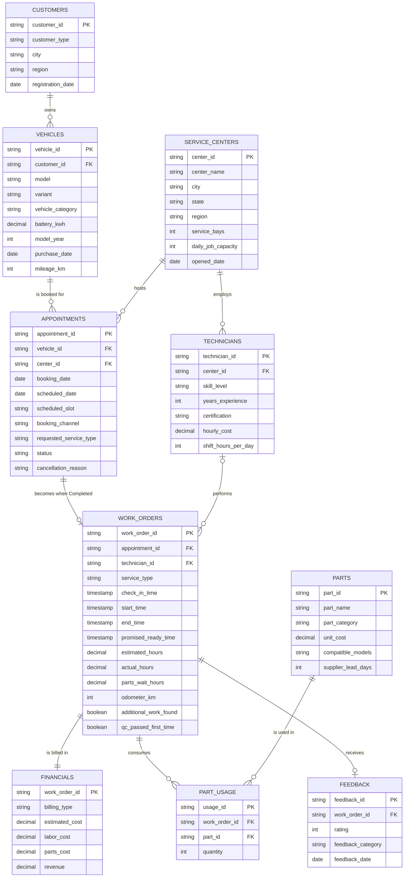
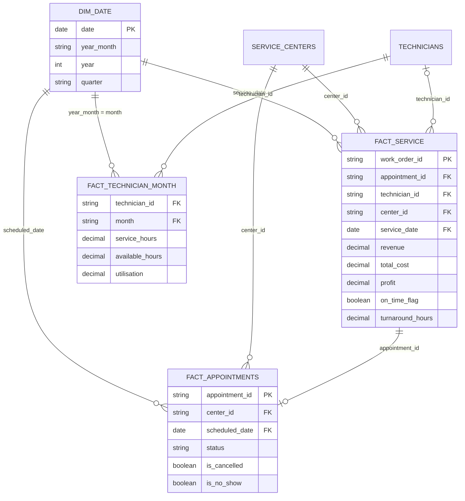

# Data Dictionary

| | |
|---|---|
| Project | Vehicle Service Operations Analytics & Process Optimization |
| Version | 1.0 |
| Date | 2026-10-05 |
| Author | Analytics Team |
| Scope | 10 normalised tables and 4 analytical extracts in `data/cleaned/` |
| Reporting period | 2025-01-01 to 2026-09-30 (21 months) |
| Currency | INR, excluding GST |

All data is **synthetic**. It models an EV two-wheeler service network resembling Ather's scooter range (Ather 450X, Ather 450 Apex, Ather Rizta) and is not affiliated with, endorsed by, or derived from Ather Energy. No real customer, vehicle or business data is used and no personal data is stored. See [data_lineage.md](data_lineage.md) for governance and [assumptions_and_limitations.md](assumptions_and_limitations.md) for modelling caveats.

Row counts, example values and null counts in this document are computed from the files in `data/cleaned/` (produced by `python -m src.data_cleaning`). The cleaning rules DQ01-DQ20 referenced in the *Source* column are described in [reports/data_quality_report.md](../reports/data_quality_report.md) and `reports/cleaning_log.csv`.

## 1. Conventions

| Topic | Convention |
|---|---|
| Naming | `snake_case`. `labor_cost` follows the project specification (American spelling); `utilisation` and `centre` text use British spelling. Column names are never translated. |
| Keys | Surrogate string keys with a fixed prefix: `CU` customer, `V` vehicle, `C` centre, `T` technician, `AP` appointment, `WO` work order, `P` part, `PU` usage line, `FB` feedback. |
| Dates and times | ISO 8601 (`YYYY-MM-DD`, `YYYY-MM-DD HH:MM:SS`). Local India Standard Time, no time-zone offset. Centres are open Monday to Saturday, 09:00-19:00; Sunday is closed. |
| Money | INR, excluding GST, two decimals. `labor_cost` and `parts_cost` are costs to the business; `revenue` is the amount billed. |
| Durations | Decimal hours. `estimated_hours` and `actual_hours` measure labour time; `turnaround_hours`, `wait_hours` and `parts_wait_hours` are elapsed clock hours. |
| Booleans | `True` / `False` in CSV. |
| Nulls | Empty cell in CSV. Nulls are deliberate and documented per field below. |
| Type names | *String, Category* (string with a small fixed set of values), *Integer, Decimal, Boolean, Date, Timestamp*. Suggested PostgreSQL types: String `VARCHAR`, Category `VARCHAR` (with `CHECK` or lookup), Integer `INTEGER`, Decimal `NUMERIC(12,2)`, Boolean `BOOLEAN`, Date `DATE`, Timestamp `TIMESTAMP`. `sql/schema.sql` is authoritative for physical types. |

## 2. Table inventory

| Table | Layer | Grain | Primary key | Rows |
|---|---|---|---|---|
| `customers` | Normalised | One row per customer_id | `customer_id` | 3,351 |
| `vehicles` | Normalised | One row per vehicle_id | `vehicle_id` | 5,300 |
| `service_centers` | Normalised | One row per center_id | `center_id` | 8 |
| `technicians` | Normalised | One row per technician_id | `technician_id` | 18 |
| `appointments` | Normalised | One row per appointment_id | `appointment_id` | 26,769 |
| `work_orders` | Normalised | One row per work_order_id | `work_order_id` | 24,092 |
| `parts` | Normalised | One row per part_id | `part_id` | 39 |
| `part_usage` | Normalised | One row per usage line (work_order_id x part_id) | `usage_id` | 46,190 |
| `financials` | Normalised | One row per work_order_id | `work_order_id (also FK)` | 24,092 |
| `feedback` | Normalised | One row per feedback_id (at most one per work order) | `feedback_id` | 12,186 |
| `fact_service` | Analytical extract | One row per work_order_id (completed services only) | `work_order_id` | 24,092 |
| `fact_appointments` | Analytical extract | One row per appointment_id | `appointment_id` | 26,769 |
| `fact_technician_month` | Analytical extract | One row per technician_id x month (18 technicians x 21 months) | `technician_id + month` | 378 |
| `dim_date` | Analytical extract | One row per calendar date | `date` | 638 |

*Normalised* tables are the cleaned source tables loaded to PostgreSQL schema `service_ops`. *Analytical extracts* are denormalised outputs of `src/data_cleaning.py` used directly by the Streamlit app and Power BI, and mirrored by SQL views.

## 3. Entity-relationship diagram

### 3.1 Normalised model

Cardinality notes: every Completed appointment has exactly one work order (24,092 = 24,092); Cancelled and No-Show appointments (2,677) have none. `financials.work_order_id` is both PK and FK, so billing is strictly 1:1. `feedback` is 0..1 per work order (12,186 of 24,092 respond). `work_orders.technician_id` is nullable for 72 rows (DQ10).

### 3.2 Analytical star schema (Power BI / Streamlit)

Modelling notes for Power BI: `dim_date[year_month]` is not unique, so `fact_technician_month` should relate to a small month table (distinct `year_month`) or be filtered with a DAX `TREATAS` on the month. Slicers for centre, region and service type must filter all three facts; a shared `service_centers` dimension and a `service_types` lookup are recommended.

## 4. Field definitions: normalised tables

### `customers`

**Purpose.** Customer master. One row per (synthetic) customer account. A customer may own several vehicles (fleet and corporate accounts own many).

| Property | Value |
|---|---|
| Grain | One row per customer_id |
| Primary key | `customer_id` |
| Foreign keys | - |
| Row count (cleaned) | 3,351 |
| Consumed by | vehicles (1:N) |
| File | `data/cleaned/customers.csv` |

| Field | Type | Example | Description | Allowed values / range | Nullable | Source | Derivation |
|---|---|---|---|---|---|---|---|
| `customer_id` | String | CU00413 | Surrogate customer key. Not linked to any real person. | `CU` + 5 digits | No | Raw | - |
| `customer_type` | Category | Corporate | Customer segment. Fleet accounts own 4-20 vehicles, corporate 2-6, individuals 1-2. | Individual, Fleet, Corporate | No | Raw | - |
| `city` | String | Hyderabad | City of the customer's home service centre (no street-level data is stored). | Bengaluru, Chennai, Hyderabad, Kolkata, Mumbai, New Delhi, Pune | No | Raw | - |
| `region` | Category | South | Region of the home service centre. | North, South, East, West | No | Raw, cleaned (DQ03) | Case and whitespace variants (`SOUTH`, ` west `) mapped to canonical label. |
| `registration_date` | Date | 2024-10-13 | Proxy for account creation: date of the customer's earliest vehicle purchase. | 2020-01-17 to 2026-09-09 | No | Raw, parsed | Minimum of the customer's vehicle purchase dates (generator). |

### `vehicles`

**Purpose.** Vehicle master. One row per scooter. Models and variants mirror the Ather 450X, 450 Apex and Rizta line-up (synthetic mix, not Ather data).

| Property | Value |
|---|---|
| Grain | One row per vehicle_id |
| Primary key | `vehicle_id` |
| Foreign keys | customer_id -> customers.customer_id |
| Row count (cleaned) | 5,300 |
| Consumed by | appointments (1:N) |
| File | `data/cleaned/vehicles.csv` |

| Field | Type | Example | Description | Allowed values / range | Nullable | Source | Derivation |
|---|---|---|---|---|---|---|---|
| `vehicle_id` | String | V00001 | Surrogate vehicle key. No VIN or registration plate is stored. | `V` + 5 digits | No | Raw | - |
| `customer_id` | String | CU00001 | Owning customer. | Must exist in customers | No | Raw | - |
| `model` | Category | Ather Rizta | Vehicle model. | Ather 450X, Ather 450 Apex, Ather Rizta | No | Raw, cleaned (DQ03) | Aliases such as `450X`, `ather rizta`, ` Ather Rizta` mapped via `MODEL_ALIASES`. |
| `variant` | Category | Rizta S 2.9kWh | Trim and battery pack. | 450X 2.9kWh, 450X 3.7kWh, 450 Apex 3.7kWh, Rizta S 2.9kWh, Rizta Z 2.9kWh, Rizta Z 3.7kWh | No | Raw | - |
| `vehicle_category` | Category | Family | Segment used for vehicle-category KPIs. | Performance (450X, 450 Apex), Family (Rizta) | No | Raw | - |
| `battery_kwh` | Decimal | 2.9 | Battery pack capacity in kWh. | 2.9, 3.7 | No | Raw | - |
| `model_year` | Integer | 2026 | Model year of the vehicle. | 2020-2026; must be >= model launch year (450X 2020; Apex and Rizta 2024) and <= purchase year + 1 | No | Raw, cleaned (DQ15) | 21 impossible values replaced by `year(purchase_date)`. |
| `purchase_date` | Date | 2026-08-22 | Date of sale to the customer. | 2020-01-17 to 2026-09-09 | No | Raw, parsed | - |
| `mileage_km` | Integer | 1048 | Estimated odometer reading at the end of the reporting period (30 Sep 2026), in km. | 321 to 264,141; null if negative or > 250 km/day since purchase | Yes (15) | Raw, cleaned (DQ16) | Set to null when `< 0` or `> days_since_purchase x 250`. Excluded from mileage analysis, not from work orders. |

### `service_centers`

**Purpose.** Service-centre master (location and capacity). Eight centres across four regions.

| Property | Value |
|---|---|
| Grain | One row per center_id |
| Primary key | `center_id` |
| Foreign keys | - |
| Row count (cleaned) | 8 |
| Consumed by | technicians, appointments (1:N each) |
| File | `data/cleaned/service_centers.csv` |

| Field | Type | Example | Description | Allowed values / range | Nullable | Source | Derivation |
|---|---|---|---|---|---|---|---|
| `center_id` | String | C001 | Service-centre key. | C001-C008 | No | Raw | - |
| `center_name` | String | Bengaluru - Indiranagar | Display name in the form `City - Locality`. | 8 values (see enumerations) | No | Raw | - |
| `city` | String | Bengaluru | City. Delhi - Saket is recorded under `New Delhi`. | Bengaluru, Chennai, Hyderabad, Pune, Mumbai, New Delhi, Kolkata | No | Raw | - |
| `state` | String | Karnataka | State or union territory. | Karnataka, Tamil Nadu, Telangana, Maharashtra, Delhi, West Bengal | No | Raw | - |
| `region` | Category | South | Reporting region. | North, South, East, West | No | Raw | - |
| `service_bays` | Integer | 8 | Number of physical service bays. Descriptive attribute; not used in any KPI. | 4-8 | No | Raw | - |
| `daily_job_capacity` | Integer | 22 | Nominal jobs per day the centre is designed to handle. Descriptive attribute; the simulation derives load from technician hours, not from this field. | 10-22 | No | Raw | - |
| `opened_date` | Date | 2019-06-01 | Date the centre opened. | 2019-06-01 to 2022-09-01 | No | Raw | - |

### `technicians`

**Purpose.** Technician master. Eighteen technicians rostered across the eight centres. No names are stored; IDs are surrogates.

| Property | Value |
|---|---|
| Grain | One row per technician_id |
| Primary key | `technician_id` |
| Foreign keys | center_id -> service_centers.center_id |
| Row count (cleaned) | 18 |
| Consumed by | work_orders (1:N), fact_technician_month |
| File | `data/cleaned/technicians.csv` |

| Field | Type | Example | Description | Allowed values / range | Nullable | Source | Derivation |
|---|---|---|---|---|---|---|---|
| `technician_id` | String | T001 | Surrogate technician key. | T001-T018 | No | Raw | - |
| `center_id` | String | C001 | Home service centre. | C001-C008 | No | Raw | - |
| `skill_level` | Category | Senior | Skill grade; drives hourly cost and certification. | Junior, Mid, Senior, Master | No | Raw | - |
| `years_experience` | Integer | 5 | Years of experience. | 0-15 (Junior 0-2, Mid 2-5, Senior 5-9, Master 9-15) | No | Raw | - |
| `certification` | Category | EV Level 3 | EV certification level matching the skill grade. | EV Level 1 (Junior), EV Level 2 (Mid), EV Level 3 (Senior), EV Level 4 (Master) | No | Raw | - |
| `hourly_cost` | Decimal | 360 | Internal labour cost per hour in INR (cost, not the billed rate). | 210, 280, 360, 450 | No | Raw | - |
| `shift_hours_per_day` | Integer | 8 | Paid shift length. Utilisation uses 7 productive hours (`PRODUCTIVE_HOURS_PER_DAY`), not this field. | 8 | No | Raw | - |

### `appointments`

**Purpose.** Booking record. One row per appointment, including cancelled and no-show bookings. Completed appointments have exactly one work order.

| Property | Value |
|---|---|
| Grain | One row per appointment_id |
| Primary key | `appointment_id` |
| Foreign keys | vehicle_id -> vehicles.vehicle_id; center_id -> service_centers.center_id |
| Row count (cleaned) | 26,769 |
| Consumed by | work_orders (1:0..1), fact_appointments |
| File | `data/cleaned/appointments.csv` |

| Field | Type | Example | Description | Allowed values / range | Nullable | Source | Derivation |
|---|---|---|---|---|---|---|---|
| `appointment_id` | String | AP005572 | Booking key. | `AP` + 6 digits | No | Raw | - |
| `vehicle_id` | String | V00715 | Vehicle being serviced. | Must exist in vehicles | No | Raw, cleaned (DQ06) | Orphan vehicle IDs removed together with dependent rows. |
| `center_id` | String | C005 | Service centre where the visit is booked. | C001-C008 | No | Raw, cleaned (DQ07) | Missing value imputed from the assigned technician's centre. |
| `booking_date` | Date | 2025-07-01 | Date the booking was made. | 2024-12-17 to 2026-09-30; <= scheduled_date | No | Raw, parsed | Capped at scheduled_date if later (DQ05, 0 rows). |
| `scheduled_date` | Date | 2025-07-01 | Date of the visit. | 2025-01-01 to 2026-09-30 (Mon-Sat) | No | Raw, cleaned (DQ04, DQ05) | ISO and `DD/MM/YYYY` strings parsed to a date; out-of-period rows removed. |
| `scheduled_slot` | String | 15:20 | Planned arrival time, `HH:MM`, 24-hour clock. 34 values carry an invalid minute `:60` (generator rounding) and should not be parsed as time. | 09:00-16:60 | No | Raw | - |
| `booking_channel` | Category | Walk-in | How the booking was made. Walk-ins are same-day and never cancelled or no-show. | Ather App, Call Centre, Walk-in, Website | No | Raw | - |
| `requested_service_type` | Category | Periodic Service | Service the customer asked for. Equals work_orders.service_type for every completed appointment. | 11 service types (see enumerations) | No | Raw | - |
| `status` | Category | Completed | Outcome of the booking. | Completed, Cancelled, No-Show | No | Raw, cleaned (DQ20) | Variants such as `canceled`, `NO-SHOW`, ` Completed` mapped to canonical labels. |
| `cancellation_reason` | Category | Personal Reasons | Reason captured when the status is Cancelled. Null for Completed and No-Show. | Customer Rescheduled, Long Wait for Slot, Personal Reasons, Visited Another Workshop, Price Concern, Issue Resolved via OTA Update | Yes (24,959) | Raw | - |

### `work_orders`

**Purpose.** Workshop job record created when a booked customer is checked in. Holds the timestamps used for turnaround, on-time and wait KPIs.

| Property | Value |
|---|---|
| Grain | One row per work_order_id |
| Primary key | `work_order_id` |
| Foreign keys | appointment_id -> appointments.appointment_id (unique); technician_id -> technicians.technician_id (nullable) |
| Row count (cleaned) | 24,092 |
| Consumed by | financials (1:1), part_usage (1:N), feedback (1:0..1), fact_service |
| File | `data/cleaned/work_orders.csv` |

| Field | Type | Example | Description | Allowed values / range | Nullable | Source | Derivation |
|---|---|---|---|---|---|---|---|
| `work_order_id` | String | WO012329 | Work-order key. | `WO` + 6 digits | No | Raw | - |
| `appointment_id` | String | AP013692 | Parent appointment; always a Completed booking. | Must exist in appointments | No | Raw, cleaned (DQ18) | Rows whose appointment was removed are cascaded out. |
| `technician_id` | String | T004 | Technician who performed the work. | T001-T018 or null | Yes (72) | Raw, cleaned (DQ10) | Missing or unknown IDs (including `T999`) set to null; the work order is kept for financial and centre KPIs. |
| `service_type` | Category | Periodic Service | Service performed. | 11 service types (see enumerations) | No | Raw, cleaned (DQ03) | Case and whitespace variants mapped to the canonical name. |
| `check_in_time` | Timestamp | 2026-01-17 11:20:48 | Vehicle received at the centre (local IST time, no time-zone offset). | 2025-01-01 09:00 to 2026-09-30 16:24 | No | Raw, parsed | - |
| `start_time` | Timestamp | 2026-01-17 12:16:41 | Technician started work (end of the waiting time). | >= check_in_time; null for 23 rows | Yes (23) | Raw, cleaned (DQ08, DQ09) | Swapped with end_time when end < start (60 rows); missing values retained as null. |
| `end_time` | Timestamp | 2026-01-17 15:05:17 | Work completed and vehicle ready for handover. | >= start_time | No | Raw, cleaned (DQ08) | - |
| `promised_ready_time` | Timestamp | 2026-01-17 14:35:48 | Ready time quoted to the customer at check-in. | - | No | Raw | `check_in_time + (estimated_hours + 1.5 h)` counted in shop hours only (Mon-Sat 09:00-19:00). |
| `estimated_hours` | Decimal | 1.75 | Labour hours quoted by the advisor. | 0.5-6.25, in 0.25 steps | No | Raw | - |
| `actual_hours` | Decimal | 2.81 | Labour hours actually worked (excludes parts waiting). | 0.34-11.07 | No | Raw | - |
| `parts_wait_hours` | Decimal | 0 | Calendar hours the job was paused waiting for a part. 0 when no stock-out occurred. | 0-571.22 | No | Raw | - |
| `odometer_km` | Integer | 34419 | Odometer reading at check-in, km. | 120-262,074 | No | Raw | - |
| `additional_work_found` | Boolean | True | Extra work identified during inspection and added to the job. | True, False | No | Raw, parsed | - |
| `qc_passed_first_time` | Boolean | True | Quality check passed at the first attempt. | True, False | No | Raw, parsed | - |

### `parts`

**Purpose.** Parts catalogue with unit cost and supplier lead time.

| Property | Value |
|---|---|
| Grain | One row per part_id |
| Primary key | `part_id` |
| Foreign keys | - |
| Row count (cleaned) | 39 |
| Consumed by | part_usage (1:N) |
| File | `data/cleaned/parts.csv` |

| Field | Type | Example | Description | Allowed values / range | Nullable | Source | Derivation |
|---|---|---|---|---|---|---|---|
| `part_id` | String | P001 | Part key. | P001-P039 | No | Raw | - |
| `part_name` | String | Brake Pad Set - Front | Catalogue description (generic, invented). | 39 values | No | Raw | - |
| `part_category` | Category | Brakes | Commodity group. | 10 categories (see enumerations) | No | Raw | - |
| `unit_cost` | Decimal | 650 | Procurement cost per unit in INR, excluding GST. | 90-32,000 | No | Raw | - |
| `compatible_models` | Category | All | Models the part fits. | All, 450 Series, Ather Rizta, Ather 450 Apex | No | Raw | - |
| `supplier_lead_days` | Integer | 3 | Days to replenish the part from the supplier when out of stock. | 1-18 | No | Raw | - |

### `part_usage`

**Purpose.** Parts consumed per work order (one line per part).

| Property | Value |
|---|---|
| Grain | One row per usage line (work_order_id x part_id) |
| Primary key | `usage_id` |
| Foreign keys | work_order_id -> work_orders.work_order_id; part_id -> parts.part_id |
| Row count (cleaned) | 46,190 |
| Consumed by | Parts cost reconciliation (DQ19), parts analysis |
| File | `data/cleaned/part_usage.csv` |

| Field | Type | Example | Description | Allowed values / range | Nullable | Source | Derivation |
|---|---|---|---|---|---|---|---|
| `usage_id` | String | PU000001 | Usage-line key. | `PU` + 6 digits | No | Raw | - |
| `work_order_id` | String | WO000001 | Work order that consumed the part. | Must exist in work_orders | No | Raw, cleaned (DQ18) | - |
| `part_id` | String | P005 | Part consumed. | Must exist in parts | No | Raw, cleaned (DQ17) | Lines with unknown part (`P999`) removed (23 rows). |
| `quantity` | Integer | 1 | Units consumed. | 1-2 (> 0) | No | Raw, cleaned (DQ17) | Lines with quantity <= 0 removed (92 rows). |

### `financials`

**Purpose.** Billing record per work order: revenue, labour cost, parts cost and the original cost estimate. Billing system of record for all financial KPIs.

| Property | Value |
|---|---|
| Grain | One row per work_order_id |
| Primary key | `work_order_id (also FK)` |
| Foreign keys | work_order_id -> work_orders.work_order_id |
| Row count (cleaned) | 24,092 |
| Consumed by | fact_service |
| File | `data/cleaned/financials.csv` |

| Field | Type | Example | Description | Allowed values / range | Nullable | Source | Derivation |
|---|---|---|---|---|---|---|---|
| `work_order_id` | String | WO001212 | Work order billed. Primary key and foreign key (1:1). | Must exist in work_orders | No | Raw, cleaned (DQ18) | - |
| `billing_type` | Category | Service Plan | Commercial treatment of the job. | Customer Paid, Service Plan, Warranty, Rework (No Charge) | No | Raw | - |
| `estimated_cost` | Decimal | 1090 | Cost expected at quote time (INR). | >= 0 | No | Raw, cleaned (DQ11) | `estimated_hours x technician hourly_cost + quoted parts at unit cost`. Excludes parts added during inspection. |
| `labor_cost` | Decimal | 640.5 | Actual labour cost (INR). | >= 0 | No | Raw, cleaned (DQ11) | `actual_hours x technician hourly_cost`. Negative sign-entry errors converted to absolute value (24 rows). |
| `parts_cost` | Decimal | 670 | Actual parts cost at unit cost (INR). | >= 0 | No | Raw, cleaned (DQ11, DQ12) | Missing values (36) recomputed as `SUM(quantity x unit_cost)` from part_usage. |
| `revenue` | Decimal | 1184 | Amount charged (INR, excluding GST). | >= 0; 0 for rework | No | Raw, cleaned (DQ11, DQ13) | Negative signs corrected (24 rows); values `> 10x job cost and > INR 50,000` divided by 100 (24 rows). |

### `feedback`

**Purpose.** Customer survey response. About half of the completed work orders have one.

| Property | Value |
|---|---|
| Grain | One row per feedback_id (at most one per work order) |
| Primary key | `feedback_id` |
| Foreign keys | work_order_id -> work_orders.work_order_id (unique) |
| Row count (cleaned) | 12,186 |
| Consumed by | fact_service (left join) |
| File | `data/cleaned/feedback.csv` |

| Field | Type | Example | Description | Allowed values / range | Nullable | Source | Derivation |
|---|---|---|---|---|---|---|---|
| `feedback_id` | String | FB003606 | Feedback key. | `FB` + 6 digits | No | Raw | - |
| `work_order_id` | String | WO007098 | Work order rated. | Must exist in work_orders; unique | No | Raw, cleaned (DQ18, DQ02) | - |
| `rating` | Integer | 4 | Customer rating. | 1-5 | No | Raw, cleaned (DQ14) | Rows with missing (24) or out-of-scale (49; values 0, 6, 10) ratings are removed. |
| `feedback_category` | Category | Staff Behaviour | Dominant theme of the response. | 9 categories (see enumerations) | No | Raw | - |
| `feedback_date` | Date | 2025-08-29 | Date the feedback was given (0-3 days after job completion; 60 rows fall after 30 Sep 2026). | 2025-01-01 to 2026-10-08 | No | Raw, parsed | - |

## 5. Field definitions: analytical extracts

### `fact_service`

**Purpose.** Analytical extract for the dashboard and SQL views: one row per completed work order, joined to vehicle, customer, centre, technician, financial and feedback attributes, with all derived KPI fields. Primary source for KPIs 1-7, 10-16.

| Property | Value |
|---|---|
| Grain | One row per work_order_id (completed services only) |
| Primary key | `work_order_id` |
| Foreign keys | appointment_id, technician_id (nullable), vehicle_id, customer_id, center_id; service_date -> dim_date.date |
| Row count (cleaned) | 24,092 |
| Consumed by | Power BI / Streamlit fact table; SQL view layer |
| File | `data/cleaned/fact_service.csv` |

| Field | Type | Example | Description | Allowed values / range | Nullable | Source | Derivation |
|---|---|---|---|---|---|---|---|
| `work_order_id` | String | WO000001 | See work_orders. | - | No | Raw | - |
| `appointment_id` | String | AP000004 | See work_orders. | - | No | Raw | - |
| `technician_id` | String | T017 | See work_orders. Null for 72 work orders (excluded from technician KPIs). | T001-T018 or null | Yes (72) | Raw, cleaned (DQ10) | - |
| `service_type` | Category | Tyre Replacement | See work_orders. | - | No | Raw, cleaned (DQ03) | - |
| `check_in_time` | Timestamp | 2025-01-01 09:00:00 | See work_orders. | - | No | Raw | - |
| `start_time` | Timestamp | 2025-01-01 09:16:40 | See work_orders. Null for 23 rows. | - | Yes (23) | Raw, cleaned (DQ08, DQ09) | - |
| `end_time` | Timestamp | 2025-01-01 11:01:04 | See work_orders. | - | No | Raw, cleaned (DQ08) | - |
| `promised_ready_time` | Timestamp | 2025-01-01 12:00:00 | See work_orders. | - | No | Raw | - |
| `estimated_hours` | Decimal | 1.5 | See work_orders. | - | No | Raw | - |
| `actual_hours` | Decimal | 1.74 | See work_orders. | - | No | Raw | - |
| `parts_wait_hours` | Decimal | 0 | See work_orders. | - | No | Raw | - |
| `odometer_km` | Integer | 19299 | See work_orders. | - | No | Raw | - |
| `additional_work_found` | Boolean | True | See work_orders. | - | No | Raw | - |
| `qc_passed_first_time` | Boolean | True | See work_orders. Basis of the QC first-pass rate (KPI 15). | - | No | Raw | - |
| `vehicle_id` | String | V03767 | Vehicle serviced. | - | No | Joined (appointments) | `appointments.vehicle_id` via appointment_id. |
| `center_id` | String | C008 | Centre where the work was done. | C001-C008 | No | Joined (appointments) | `appointments.center_id` via appointment_id. |
| `booking_channel` | Category | Ather App | Channel of the originating booking. | Ather App, Call Centre, Walk-in, Website | No | Joined (appointments) | - |
| `customer_id` | String | CU02436 | Owning customer. | - | No | Joined (vehicles) | - |
| `model` | Category | Ather 450X | Vehicle model. | Ather 450X, Ather 450 Apex, Ather Rizta | No | Joined (vehicles) | - |
| `variant` | Category | 450X 2.9kWh | Vehicle variant. | 6 values | No | Joined (vehicles) | - |
| `vehicle_category` | Category | Performance | Performance or Family. | Performance, Family | No | Joined (vehicles) | - |
| `customer_type` | Category | Individual | Customer segment. | Individual, Fleet, Corporate | No | Joined (customers) | - |
| `center_name` | String | Kolkata - Salt Lake | Centre display name. | - | No | Joined (service_centers) | - |
| `city` | String | Kolkata | Centre city. | - | No | Joined (service_centers) | - |
| `region` | Category | East | Centre region. | North, South, East, West | No | Joined (service_centers) | - |
| `skill_level` | Category | Senior | Technician skill grade. Null when technician_id is null. | Junior, Mid, Senior, Master | Yes (72) | Joined (technicians) | - |
| `billing_type` | Category | Customer Paid | See financials. | Customer Paid, Service Plan, Warranty, Rework (No Charge) | No | Joined (financials) | - |
| `estimated_cost` | Decimal | 4520 | See financials. | - | No | Joined (financials) | - |
| `labor_cost` | Decimal | 626.4 | See financials. | - | No | Joined (financials) | - |
| `parts_cost` | Decimal | 3980 | See financials. | - | No | Joined (financials) | - |
| `revenue` | Decimal | 6692.75 | See financials. Basis of KPI 1. | - | No | Joined (financials) | - |
| `rating` | Integer | 4 | Customer rating 1-5. Null (by design) when the customer did not respond: 11,906 of 24,092 work orders (49.4%). | 1-5 or null | Yes (11,906) | Joined (feedback) | Left join on work_order_id. |
| `feedback_category` | Category | Positive Experience | Feedback theme. Null when rating is null. | 9 categories | Yes (11,906) | Joined (feedback) | - |
| `service_date` | Date | 2025-01-01 | Calendar date of check-in; key to dim_date. | 2025-01-01 to 2026-09-30 | No | Derived | `date(check_in_time)` |
| `year` | Integer | 2025 | Calendar year of service_date. | 2025, 2026 | No | Derived | `year(service_date)` |
| `month` | String | 2025-01 | Year-month of service_date, `YYYY-MM`. | 2025-01 to 2026-09 | No | Derived | `format(service_date, 'YYYY-MM')` |
| `wait_hours` | Decimal | 0.28 | Customer wait before work starts (KPI 16). Null when start_time is missing. | >= 0; max 71.99 | Yes (23) | Derived | `(start_time - check_in_time)` in hours, rounded to 2 dp. |
| `turnaround_hours` | Decimal | 2.02 | Elapsed clock time from check-in to ready (KPI 6). Includes closed hours (nights, Sundays) and parts waiting. | 0.38-577.37 | No | Derived | `(end_time - check_in_time)` in hours, rounded to 2 dp. |
| `late_hours` | Decimal | 0 | Hours beyond the promised ready time; 0 when on time. | >= 0 | No | Derived | `max(0, end_time - promised_ready_time)` in hours, rounded to 2 dp. |
| `on_time_flag` | Boolean | True | True when the vehicle was ready by the promised time (KPI 5). | True, False | No | Derived | `end_time <= promised_ready_time` |
| `duration_variance_hours` | Decimal | 0.24 | Actual minus estimated labour hours (KPI 13). Positive = overrun. | -2.56 to +4.99 | No | Derived | `actual_hours - estimated_hours`, rounded to 2 dp. |
| `parts_delay_flag` | Boolean | False | True when the job waited for parts (KPI 14). | True, False | No | Derived | `parts_wait_hours > 0` |
| `total_cost` | Decimal | 4606.4 | Total job cost (KPI 2). | >= 0 | No | Derived | `labor_cost + parts_cost` |
| `profit` | Decimal | 2086.35 | Job profit (KPI 3). Negative for some warranty and rework jobs (2,647 rows). | -33,252.80 to +17,466.98 | No | Derived | `revenue - total_cost` |
| `cost_variance` | Decimal | 86.4 | Actual minus estimated cost (KPI 7). Positive = overrun. | -1,152 to +33,342.80 | No | Derived | `total_cost - estimated_cost` |
| `cost_variance_pct` | Decimal | 0.0191 | Cost variance as a fraction of the estimate (0.0191 = 1.91%). Null if estimated_cost is 0. | -0.41 to 103.12 (extreme values arise on very small estimates) | No | Derived | `cost_variance / estimated_cost`, rounded to 4 dp. |
| `cost_overrun_flag` | Boolean | False | True when the cost exceeded the estimate by more than 10%. | True, False | No | Derived | `cost_variance_pct > 0.10` |
| `vehicle_age_years` | Decimal | 3.28 | Vehicle age at service. | 0.04-6.65 | No | Derived | `(service_date - purchase_date) / 365.25`, rounded to 2 dp. |
| `days_since_same_service` | Decimal | 5 | Whole days since the previous completed visit of the same vehicle and service type ended. Null for a vehicle's first visit of that type. Seven rows are negative (job overlapped the previous one). | -4 to 625 or null | Yes (12,993) | Derived | `floor_days(check_in_time - previous end_time)` within (vehicle_id, service_type). |
| `is_repeat_visit` | Boolean | False | This visit is a comeback: same vehicle and service type within 30 days of the previous one. | True, False | No | Derived | `days_since_same_service <= 30` (`REPEAT_VISIT_WINDOW_DAYS`). |
| `caused_repeat_visit` | Boolean | False | This job was followed by a same-service return within 30 days (KPI 12). Attributes the comeback to the original job and technician. | True, False | No | Derived | `days(next check_in_time - end_time) <= 30` within (vehicle_id, service_type). |
| `customer_visit_number` | Integer | 1 | Sequence number of this completed visit for the customer. | 1-167 | No | Derived | Running count of work orders per customer ordered by check_in_time. |

### `fact_appointments`

**Purpose.** Analytical extract: one row per appointment (all statuses) with customer, vehicle and centre attributes and lead-time fields. Primary source for KPI 8 (cancellation and no-show rates).

| Property | Value |
|---|---|
| Grain | One row per appointment_id |
| Primary key | `appointment_id` |
| Foreign keys | vehicle_id, customer_id, center_id; scheduled_date -> dim_date.date |
| Row count (cleaned) | 26,769 |
| Consumed by | Power BI / Streamlit Customer Experience page |
| File | `data/cleaned/fact_appointments.csv` |

| Field | Type | Example | Description | Allowed values / range | Nullable | Source | Derivation |
|---|---|---|---|---|---|---|---|
| `appointment_id` | String | AP005572 | See appointments. | - | No | Raw | - |
| `vehicle_id` | String | V00715 | See appointments. | - | No | Raw, cleaned (DQ06) | - |
| `center_id` | String | C005 | See appointments. | - | No | Raw, cleaned (DQ07) | - |
| `booking_date` | Date | 2025-07-01 | See appointments. | - | No | Raw | - |
| `scheduled_date` | Date | 2025-07-01 | See appointments. | - | No | Raw, cleaned (DQ04) | - |
| `scheduled_slot` | String | 15:20 | See appointments. | - | No | Raw | - |
| `booking_channel` | Category | Walk-in | See appointments. | - | No | Raw | - |
| `requested_service_type` | Category | Periodic Service | See appointments. | - | No | Raw | - |
| `status` | Category | Completed | See appointments. | Completed, Cancelled, No-Show | No | Raw, cleaned (DQ20) | - |
| `cancellation_reason` | Category | Personal Reasons | See appointments. | - | Yes (24,959) | Raw | - |
| `customer_id` | String | CU00476 | Owning customer. | - | No | Joined (vehicles) | - |
| `model` | Category | Ather 450X | Vehicle model. | - | No | Joined (vehicles) | - |
| `vehicle_category` | Category | Performance | Performance or Family. | - | No | Joined (vehicles) | - |
| `customer_type` | Category | Individual | Customer segment. | - | No | Joined (customers) | - |
| `center_name` | String | Pune - Baner | Centre display name. | - | No | Joined (service_centers) | - |
| `region` | Category | West | Centre region. | - | No | Joined (service_centers) | - |
| `lead_days` | Integer | 0 | Days between booking and visit; 0 for same-day and walk-in. | 0-39 | No | Derived | `scheduled_date - booking_date` in days. |
| `lead_time_band` | Category | Same day | Banded lead time. | Same day, 1-3 days, 4-7 days, 8-14 days, 15+ days | No | Derived | `pd.cut(lead_days, [-1,0,3,7,14,999])` |
| `weekday` | Category | Tuesday | Weekday name of scheduled_date. | Monday-Saturday | No | Derived | `day_name(scheduled_date)` |
| `month` | String | 2025-07 | Year-month of scheduled_date. | 2025-01 to 2026-09 | No | Derived | `format(scheduled_date, 'YYYY-MM')` |
| `is_cancelled` | Boolean | False | Status is Cancelled. Numerator of the cancellation rate. | True, False | No | Derived | `status = 'Cancelled'` |
| `is_no_show` | Boolean | False | Status is No-Show. Numerator of the no-show rate (reported separately). | True, False | No | Derived | `status = 'No-Show'` |
| `is_completed` | Boolean | True | Status is Completed. | True, False | No | Derived | `status = 'Completed'` |

### `fact_technician_month`

**Purpose.** Analytical extract: technician capacity and workload by month, including months with no work. Primary source for KPI 9 (utilisation) and technician quality KPIs.

| Property | Value |
|---|---|
| Grain | One row per technician_id x month (18 technicians x 21 months) |
| Primary key | `technician_id + month` |
| Foreign keys | technician_id -> technicians; center_id -> service_centers; month -> dim_date.year_month |
| Row count (cleaned) | 378 |
| Consumed by | Power BI / Streamlit Operations page |
| File | `data/cleaned/fact_technician_month.csv` |

| Field | Type | Example | Description | Allowed values / range | Nullable | Source | Derivation |
|---|---|---|---|---|---|---|---|
| `technician_id` | String | T001 | Technician. | T001-T018 | No | Raw | - |
| `center_id` | String | C001 | Home centre of the technician. | C001-C008 | No | Raw | - |
| `skill_level` | Category | Senior | Skill grade. | Junior, Mid, Senior, Master | No | Raw | - |
| `month` | String | 2025-01 | Calendar month `YYYY-MM`. | 2025-01 to 2026-09 | No | Derived | Cross join of technicians with the 21 reporting months. |
| `working_days` | Integer | 27 | Working days (Monday-Saturday) in the month. | 24-27 | No | Derived | Count of dates in the month with weekday in `WORKING_WEEKDAYS` (0-5). |
| `jobs` | Integer | 39 | Work orders handled (by check-in month). | 15-140 | No | Derived | `COUNT(work_order_id)` from fact_service where technician_id = this technician; 0 if none. |
| `service_hours` | Decimal | 82.78 | Actual labour hours worked. | 26.56-320.49 | No | Derived | `SUM(actual_hours)` for the technician-month, rounded to 2 dp. |
| `qc_first_pass` | Decimal | 0.923077 | Share of the month's jobs that passed quality check first time. | 0.767-1.0 | No | Derived | `AVG(qc_passed_first_time)` |
| `comebacks_caused` | Integer | 1 | Jobs in the month followed by a same-service return within 30 days. | 0-15 | No | Derived | `SUM(caused_repeat_visit)` |
| `available_hours` | Decimal | 189 | Bookable capacity in the month. | 168-189 | No | Derived | `working_days x 7.0` (`PRODUCTIVE_HOURS_PER_DAY`). |
| `utilisation` | Decimal | 0.438 | Technician utilisation as a fraction (KPI 9). Values above 1.0 (68 of 378 rows) signal overload. | 0.158-1.732 | No | Derived | `service_hours / available_hours`, rounded to 4 dp. |

### `dim_date`

**Purpose.** Calendar dimension for Power BI time intelligence, covering every day in the reporting period.

| Property | Value |
|---|---|
| Grain | One row per calendar date |
| Primary key | `date` |
| Foreign keys | - |
| Row count (cleaned) | 638 |
| Consumed by | Relationships from fact_service.service_date and fact_appointments.scheduled_date |
| File | `data/cleaned/dim_date.csv` |

| Field | Type | Example | Description | Allowed values / range | Nullable | Source | Derivation |
|---|---|---|---|---|---|---|---|
| `date` | Date | 2025-01-01 | Calendar date. | 2025-01-01 to 2026-09-30 | No | Derived | `date_range(PERIOD_START, PERIOD_END)` |
| `year` | Integer | 2025 | Calendar year. | 2025, 2026 | No | Derived | - |
| `quarter` | Category | Q1 | Calendar quarter label. | Q1-Q4 | No | Derived | `'Q' + quarter(date)` |
| `month_number` | Integer | 1 | Month number. | 1-12 | No | Derived | - |
| `month_name` | Category | Jan | Three-letter month name. | Jan-Dec | No | Derived | - |
| `year_month` | String | 2025-01 | Year-month key `YYYY-MM`; joins to fact_technician_month.month. | 2025-01 to 2026-09 | No | Derived | - |
| `weekday_number` | Integer | 3 | ISO weekday number (Monday = 1). | 1-7 | No | Derived | `weekday(date) + 1` |
| `weekday_name` | Category | Wednesday | Weekday name. | Monday-Sunday | No | Derived | - |
| `is_working_day` | Boolean | True | Centres operate Monday to Saturday. | True (Mon-Sat), False (Sun) | No | Derived | `weekday(date) in WORKING_WEEKDAYS` |

## 6. Enumerations and reference values

### 6.1 Service types (11)

`base_hours` is the standard labour allowance used by the simulation (`src/reference_data.py`); the quoted `estimated_hours` varies around it (about 0.95-1.10x, plus 0.25 h per additional part, rounded to 0.25 h). *Complex* jobs are assigned preferentially to senior technicians and carry higher QC-failure and comeback risk. *Warranty-eligible* types can be billed as Warranty when the vehicle is under 3 years old and parts are used.

| Service type | Base hours | Complex job | Warranty-eligible | Work orders | Avg estimated hours (actual data) |
|---|---|---|---|---|---|
| Periodic Service | 1.5 | No | No | 14,205 | 1.80 |
| Battery Health Check | 1.0 | No | Yes | 1,662 | 0.99 |
| Software Update Support | 0.75 | No | No | 925 | 0.74 |
| Brake Service | 1.5 | No | No | 1,638 | 1.81 |
| Tyre Replacement | 1.0 | No | No | 1,395 | 1.26 |
| Belt Drive Service | 2.0 | No | No | 933 | 2.08 |
| Motor & Controller Repair | 4.0 | Yes | Yes | 401 | 4.07 |
| Charging System Repair | 2.5 | Yes | Yes | 668 | 2.60 |
| Electrical Diagnostics | 2.0 | Yes | Yes | 1,118 | 2.09 |
| Suspension Service | 2.5 | No | No | 562 | 2.63 |
| Accident & Body Repair | 5.0 | Yes | No | 585 | 5.29 |
| **Total** | | | | **24,092** | 1.86 |

### 6.2 Billing types (4)

| Billing type | Meaning and revenue rule | Work orders | Revenue (INR) |
|---|---|---|---|
| Customer Paid | `billed_hours x 750 + parts_cost x 1.30`, where billed_hours = estimated_hours (x1.35 if additional work found); Fleet customers get 10% off. | 15,609 | 57,973,250 |
| Service Plan | Periodic Service on a plan-enrolled vehicle: flat INR 950 + non-consumable parts x 1.30. | 6,379 | 9,105,456 |
| Warranty | `estimated_hours x 500 + parts_cost x 1.05`. Warranty-eligible service type, parts used, vehicle < 3 years old (85% of eligible jobs). | 1,211 | 11,159,958 |
| Rework (No Charge) | Comeback visit generated by the simulation; revenue is 0 but labour and parts cost are still incurred. | 893 | 0 |

### 6.3 Appointment statuses and booking channels

| Status | Meaning | Appointments | Share |
|---|---|---|---|
| Completed | Customer attended; a work order exists | 24,092 | 90.00% |
| Cancelled | Booking cancelled before the visit; reason recorded | 1,810 | 6.76% |
| No-Show | Customer did not attend; no reason recorded | 867 | 3.24% |

| Booking channel | Appointments | Share |
|---|---|---|
| Ather App | 14,763 | 55.1% |
| Call Centre | 5,713 | 21.3% |
| Walk-in | 3,763 | 14.1% |
| Website | 2,530 | 9.5% |

| Lead-time band | Appointments |
|---|---|
| Same day | 4,083 |
| 1-3 days | 11,457 |
| 4-7 days | 8,050 |
| 8-14 days | 2,893 |
| 15+ days | 286 |

### 6.4 Cancellation reasons (6)

| Reason | Cancelled appointments | Share of cancellations |
|---|---|---|
| Customer Rescheduled | 500 | 27.6% |
| Long Wait for Slot | 420 | 23.2% |
| Personal Reasons | 288 | 15.9% |
| Visited Another Workshop | 274 | 15.1% |
| Price Concern | 250 | 13.8% |
| Issue Resolved via OTA Update | 78 | 4.3% |
| **Total** | **1,810** | |

### 6.5 Feedback categories (9)

Categories are assigned by rule in the simulation: ratings of 4-5 draw from the positive themes; lower ratings take the first matching cause in the order Repeat Issue, Parts Availability, Turnaround Time, Waiting Time, Pricing, else a neutral theme. Frequencies therefore reflect this priority order (for example, Waiting Time is rarely seen because late jobs are tagged Turnaround Time first).

| Category | Sentiment | Responses | Rating range | Mean rating |
|---|---|---|---|---|
| Positive Experience | Positive | 5,468 | 4-5 | 4.44 |
| Service Quality | Positive / neutral | 2,343 | 2-5 | 4.39 |
| Turnaround Time | Negative | 1,764 | 1-3 | 2.83 |
| Staff Behaviour | Positive / neutral | 1,428 | 3-5 | 4.37 |
| Parts Availability | Negative | 519 | 1-3 | 2.68 |
| Repeat Issue | Negative | 363 | 1-3 | 2.57 |
| Pricing | Neutral / negative | 167 | 2-3 | 2.99 |
| Communication | Neutral | 127 | 2-3 | 2.97 |
| Waiting Time | Negative | 7 | 3-3 | 3.00 |
| **Total** | | **12,186** | | 4.02 |

### 6.6 Technician skill levels (4)

| Skill level | Technicians | Hourly cost (INR) | Certification | Experience (years, actual) | Work orders handled |
|---|---|---|---|---|---|
| Junior | 4 | 210 | EV Level 1 | 0-2 | 6,323 |
| Mid | 4 | 280 | EV Level 2 | 2-3 | 6,052 |
| Senior | 8 | 360 | EV Level 3 | 5-9 | 9,526 |
| Master | 2 | 450 | EV Level 4 | 13-15 | 2,119 |
| (no valid technician) | | | | | 72 |

### 6.7 Part categories (10)

`Base stock-out risk` is the simulation's baseline probability (before centre and model multipliers) that a required part is unavailable at check-in; see `STOCKOUT_BASE` in `src/reference_data.py`.

| Part category | Parts | Unit cost range (INR) | Avg supplier lead (days) | Base stock-out risk | Usage lines | Parts spend at unit cost (INR) |
|---|---|---|---|---|---|---|
| Battery & Electrical | 6 | 850-18,500 | 8.5 | 8.0% | 1,824 | 8,372,350 |
| Brakes | 4 | 180-1,450 | 3.2 | 2.0% | 14,700 | 6,611,650 |
| Consumables | 3 | 120-250 | 1.3 | 0.4% | 21,555 | 4,890,650 |
| Motor & Controller | 5 | 1,200-32,000 | 11.2 | 16.0% | 532 | 4,676,300 |
| Tyres | 3 | 90-2,100 | 3.3 | 3.0% | 3,097 | 3,993,480 |
| Body & Lighting | 6 | 650-4,900 | 7.7 | 6.0% | 1,193 | 3,249,500 |
| Charging | 4 | 1,400-7,800 | 8.0 | 10.0% | 823 | 3,178,600 |
| Drivetrain | 2 | 2,300-3,800 | 6.5 | 5.0% | 1,139 | 3,116,200 |
| Dashboard & Display | 3 | 1,900-11,500 | 11.0 | 18.0% | 484 | 2,603,200 |
| Suspension | 3 | 550-7,200 | 7.0 | 5.0% | 843 | 2,454,050 |

### 6.8 Regions, centres and rosters

| Region | Centre ID | Centre | City | State | Bays | Job capacity/day | Technicians (skills) | Work orders |
|---|---|---|---|---|---|---|---|---|
| South | C001 | Bengaluru - Indiranagar | Bengaluru | Karnataka | 8 | 22 | 3 (Senior, Junior, Mid) | 4,117 |
| South | C002 | Bengaluru - Whitefield | Bengaluru | Karnataka | 7 | 18 | 3 (Senior, Junior, Senior) | 3,894 |
| South | C003 | Chennai - Anna Nagar | Chennai | Tamil Nadu | 6 | 16 | 2 (Mid, Senior) | 3,409 |
| South | C004 | Hyderabad - Gachibowli | Hyderabad | Telangana | 6 | 15 | 2 (Mid, Senior) | 2,239 |
| West | C005 | Pune - Baner | Pune | Maharashtra | 6 | 15 | 2 (Senior, Master) | 2,117 |
| West | C006 | Mumbai - Andheri | Mumbai | Maharashtra | 5 | 12 | 2 (Junior, Mid) | 3,334 |
| North | C007 | Delhi - Saket | New Delhi | Delhi | 6 | 15 | 2 (Master, Junior) | 2,843 |
| East | C008 | Kolkata - Salt Lake | Kolkata | West Bengal | 4 | 10 | 2 (Senior, Senior) | 2,139 |

### 6.9 Customer types and vehicle models

| Customer type | Customers | Vehicles | Work orders |
|---|---|---|---|
| Individual | 3,128 | 3,301 | 11,055 |
| Fleet | 138 | 1,678 | 11,633 |
| Corporate | 85 | 321 | 1,404 |

| Model | Category | Variants | Vehicles | Work orders |
|---|---|---|---|---|
| Ather 450X | Performance | 450X 2.9kWh, 450X 3.7kWh | 2,405 | 13,906 |
| Ather 450 Apex | Performance | 450 Apex 3.7kWh | 396 | 1,289 |
| Ather Rizta | Family | Rizta S 2.9kWh, Rizta Z 2.9kWh, Rizta Z 3.7kWh | 2,499 | 8,897 |

## 7. Referential integrity and validation summary

All checks run on `data/cleaned/` and pass (0 violations):

| Check | Result |
|---|---|
| Duplicate primary keys in any table | 0 |
| `vehicles.customer_id` in `customers` | 0 orphans |
| `appointments.vehicle_id` in `vehicles`; `appointments.center_id` in `service_centers` | 0 orphans |
| `work_orders.appointment_id` in `appointments` (and `status = Completed`) | 0 orphans |
| `work_orders.technician_id` in `technicians` when not null | 0 orphans (72 nulls by design) |
| `financials`, `part_usage`, `feedback` parent work order exists | 0 orphans |
| `part_usage.part_id` in `parts` | 0 orphans |
| `end_time >= start_time`; negative revenue or cost; rating outside 1-5 | 0 |
| Work orders without financials or centre | 0 |

Known data quirks that are *not* repaired by DQ01-DQ20 (documented, immaterial to KPIs): 34 `scheduled_slot` values end in `:60`; 60 `feedback_date` values fall after 2026-09-30 (survey lag, up to 3 days after completion); 7 `days_since_same_service` values are negative (overlapping jobs); `vehicles.mileage_km` and `work_orders.odometer_km` reach about 264,000 km, which is high for a scooter but passes the 250 km/day plausibility rule.
