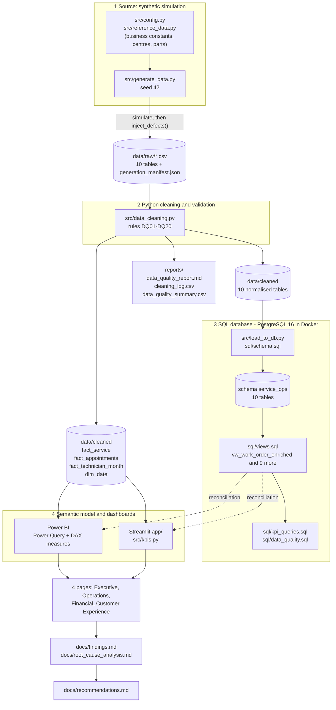

# Data Lineage and Governance

| | |
|---|---|
| Project | Vehicle Service Operations Analytics & Process Optimization |
| Version | 1.0 |
| Date | 2026-10-05 |
| Author | Analytics Team |
| Purpose | Trace every KPI from the dashboard back to source fields; document data governance (spec section 15) |
| Companion documents | [business_requirements.md](business_requirements.md) (KPI definitions), [data_dictionary.md](data_dictionary.md) (fields), [assumptions_and_limitations.md](assumptions_and_limitations.md), [../reports/data_quality_report.md](../reports/data_quality_report.md) |

## 1. End-to-end lineage

### 1.1 Flow from source to dashboard

### 1.2 Layer summary

| Layer | Artefact | Produced by | Row counts | Controls |
|---|---|---|---|---|
| Source | Reference data and constants | `src/config.py`, `src/reference_data.py` | 8 centres, 39 parts, 11 service types | Single source of business thresholds |
| Raw | `data/raw/*.csv` (10 files) and `generation_manifest.json` | `src/generate_data.py` | 142,744 rows across 10 tables (section 3) | Fixed seed; manifest lists every injected defect |
| Cleaned (normalised) | `data/cleaned/<table>.csv` (10 files) | `src/data_cleaning.py` | See section 3 | DQ01-DQ20, post-clean validation (6 checks, all 0) |
| Cleaned (analytical) | `fact_service`, `fact_appointments`, `fact_technician_month`, `dim_date` | `src/data_cleaning.py` | 24,092 / 26,769 / 378 / 638 | Derived-field rules in section 4 |
| Quality evidence | `reports/data_quality_report.md`, `cleaning_log.csv`, `data_quality_summary.csv` | `src/data_cleaning.py` | 45 log entries | Every rule logged with rows affected |
| Database | PostgreSQL schema `service_ops` | `src/load_to_db.py` with `sql/schema.sql` | Same as cleaned normalised tables | PK/FK constraints; row-count check against CSVs after load |
| KPI layer | Views `vw_*` and `sql/kpi_queries.sql` | `sql/views.sql` | n/a | Mirrors `src/config.py` constants; `sql/data_quality.sql` regression checks |
| Presentation | Power BI report; Streamlit app | `powerbi/`, `app/` | n/a | Reconciliation (BRD AC-03) |

---

## 2. Stage detail

### 2.1 Generation

`src/generate_data.py` simulates the network from vehicle sale to feedback, then injects documented data-entry defects. Operational patterns (capacity pressure, parts stock-outs, skill-driven rework) emerge from the simulation rather than being written into outputs. The simulation seed is `SEED = 42` (`src/config.py`); defect injection uses `SEED + 1`. The generator never reads external data.

### 2.2 Injected defects, detection and treatment

The manifest (`data/raw/generation_manifest.json`) records what was injected; the cleaning log records what was detected. The two agree, which is evidence that the cleaning rules are complete for the injected defect classes.

| Table | Injected defect | Injected | Rule | Logged rows | Treatment | Effect on KPIs if left uncorrected |
|---|---|---|---|---|---|---|
| customers | Region case/whitespace variants | 33 | DQ03 | 33 | Map to North/South/East/West | Region splits fragment (extra categories) |
| customers | Duplicate rows | 13 | DQ01 | 13 | Remove | Inflated customer counts |
| vehicles | Model name variants | 26 | DQ03 | 26 | Map via `MODEL_ALIASES` | Model-level KPIs split |
| vehicles | Model year before launch | 21 | DQ15 | 21 | Impute `year(purchase_date)` | Vehicle-age errors |
| vehicles | Negative or implausible mileage | 15 | DQ16 | 15 | Set to null | Mileage averages distorted |
| appointments | Status spelling variants | 107 | DQ20 | 107 | Map to Completed/Cancelled/No-Show | Cancellation rate understated |
| appointments | `DD/MM/YYYY` dates mixed with ISO | 214 | DQ04 | 214 | Parse both formats | Records dropped from monthly trends |
| appointments | Missing `center_id` | 40 | DQ07 | 40 | Impute from the technician's centre | Jobs missing from centre KPIs |
| appointments | Orphan `vehicle_id` | 26 | DQ06 | 26 | Remove with dependants | Broken joins to model and customer |
| appointments | Duplicate rows | 160 | DQ01 | 160 | Remove | Bookings and cancellation counts inflated |
| work_orders | Start and end swapped | 60 | DQ08 | 60 | Swap back | Negative turnaround; wrong on-time flag |
| work_orders | Missing technician | 48 | DQ10 | 72 (with the 24 below) | Set to null; keep job | Technician KPIs: job unattributed |
| work_orders | Unknown technician `T999` | 24 | DQ10 | (in 72) | Set to null; keep job | As above |
| work_orders | Missing `start_time` | 24 | DQ09 | 23 | Keep; wait excluded | Wait average biased if filled with zeros |
| work_orders | Service-type variants | 120 | DQ03 | 120 | Map to canonical name | Service-type KPIs and comeback matching break |
| work_orders | Duplicate rows | 96 | DQ01 | 96 | Remove | Revenue and counts inflated |
| financials | Negative amounts | 48 | DQ11 | 48 (24 revenue, 24 labour) | Absolute value | Revenue and cost understated |
| financials | Missing `parts_cost` | 36 | DQ12 | 36 | Recompute from `part_usage` x `unit_cost` | Cost understated |
| financials | Revenue 100x too large | 24 | DQ13 | 24 | Divide by 100 | Revenue overstated by about INR 8.9 M (11.4% of cleaned revenue) before correction |
| financials | Duplicate rows | 72 | DQ01 | 72 | Remove | Revenue and cost inflated |
| feedback | Rating out of 1-5 (0, 6, 10) | 49 | DQ14 | 49 | Remove row | Mean rating distorted |
| feedback | Missing rating | 24 | DQ14 | 24 | Remove row | Rating sample shrinks |
| feedback | Duplicate rows | 36 | DQ01 | 36 | Remove | Over-weighted responses |
| part_usage | Quantity 0 or -1 | 92 | DQ17 | 92 | Remove line | Parts quantities wrong |
| part_usage | Unknown `part_id` `P999` | 23 | DQ17 | 23 | Remove line | Orphan parts |

Cascade removals (DQ18) follow from DQ06: 25 work orders, 25 financial rows, 50 part-usage lines and 8 feedback rows. Rules that ran with 0 affected rows: DQ02 (no conflicting duplicate keys), DQ05, the "no technician to infer from" branch of DQ07, DQ01 on vehicles and part usage, and DQ11 on `estimated_cost` and `parts_cost`. The rule IDs DQ01-DQ20 in this document and in `reports/` refer to the Python cleaning rules; `sql/data_quality.sql` uses its own check IDs (also prefixed `DQ`) for SQL-side validation, so always cite the file when quoting an ID.

### 2.3 Cleaning

`src/data_cleaning.py` reads `data/raw/*.csv` and applies the rules in dependency order: customers, vehicles, appointments, work orders, part usage, financials, feedback. Order matters: appointments are cleaned before work orders so that orphan appointments cascade; part usage is cleaned before financials so that `parts_cost` can be recomputed. After cleaning, six validation checks run on `fact_service` and all return 0 (end before start; negative revenue or cost; ratings outside 1-5; work orders without financials; work orders without a centre; duplicate work-order IDs).

### 2.4 Database load

`python -m src.load_to_db` runs `sql/schema.sql` (drops and recreates schema `service_ops`), copies each cleaned CSV in foreign-key order, runs `sql/views.sql`, and verifies row counts against the CSV files, all in one transaction. Credentials come from environment variables (section 6.3). The four analytical extracts are not loaded as tables; the SQL views reproduce the same derived fields from the normalised tables so that SQL and Python can be reconciled independently.

### 2.5 Presentation

Power BI and Streamlit read the analytical extracts (`fact_service`, `fact_appointments`, `fact_technician_month`, `dim_date`). Streamlit uses `src/kpis.py`, which implements the same 16 KPI formulas; Power BI uses DAX measures documented under `powerbi/`. Both are reconciled against `vw_kpi_summary`.

---

## 3. Row-count lineage (raw to cleaned)

Source: `reports/data_quality_summary.csv`.

| Table | Raw rows | Exact duplicates | Null cells (raw) | Cleaned rows | Removed | Retained |
|---|---|---|---|---|---|---|
| customers | 3,364 | 13 | 0 | 3,351 | 13 | 99.61% |
| vehicles | 5,300 | 0 | 0 | 5,300 | 0 | 100.00% |
| service_centers | 8 | 0 | 0 | 8 | 0 | 100.00% |
| technicians | 18 | 0 | 0 | 18 | 0 | 100.00% |
| appointments | 26,955 | 160 | 25,178 | 26,769 | 186 | 99.31% |
| work_orders | 24,213 | 96 | 72 | 24,092 | 121 | 99.50% |
| parts | 39 | 0 | 0 | 39 | 0 | 100.00% |
| part_usage | 46,355 | 0 | 0 | 46,190 | 165 | 99.64% |
| financials | 24,189 | 72 | 36 | 24,092 | 97 | 99.60% |
| feedback | 12,303 | 36 | 24 | 12,186 | 117 | 99.05% |

Appointment null cells are dominated by `cancellation_reason`, which is legitimately empty for non-cancelled bookings (25,137 of 25,178).

---

## 4. Field-level lineage for each KPI

Chain: **raw field(s)** -> **cleaning rule(s)** -> **cleaned / derived column** (Python, in `fact_service`, `fact_appointments` or `fact_technician_month`) -> **SQL object** (column in `sql/views.sql`) -> **dashboard visual and measure**. Measure names are the canonical names for the DAX in `powerbi/` and the matching functions in `src/kpis.py`. "WO" means work order. Rule IDs are defined in [section 2.2](#22-injected-defects-detection-and-treatment).

| # | KPI | Raw source field(s) | Cleaning rules | Cleaned / derived column | SQL object (column) | Dashboard visual and measure |
|---|---|---|---|---|---|---|
| 1 | Total Revenue | `financials.revenue`; `work_orders.work_order_id` (join) | DQ01 duplicates (72); DQ11 sign (24); DQ13 x100 (24); DQ18 cascade (25) | `fact_service.revenue` | `vw_work_order_enriched.revenue`; `vw_monthly_financials.revenue`; `vw_kpi_summary.total_revenue` | P1 KPI card and monthly trend; P3 revenue vs cost. `[Total Revenue] = SUM(fact_service[revenue])` |
| 2 | Total Cost | `financials.labor_cost`, `financials.parts_cost`; fallback `part_usage.quantity` x `parts.unit_cost` | DQ01; DQ11 labour sign (24); DQ12 missing parts cost (36); DQ17 usage clean-up; DQ19 reconcile (114, report only) | `fact_service.total_cost = labor_cost + parts_cost` | `vw_work_order_enriched.total_cost`; `vw_kpi_summary.total_cost` | P1 card; P3 revenue vs cost, labour vs parts. `[Total Cost] = SUM(labor_cost) + SUM(parts_cost)` |
| 3 | Profit and Margin % | `revenue`, `labor_cost`, `parts_cost` | As KPIs 1 and 2 | `fact_service.profit = revenue - total_cost` | `vw_work_order_enriched.profit`; `vw_kpi_summary.profit`, `profit_margin` | P1 card and centre ranking; P3 profit by centre and service type. `[Profit] = [Total Revenue] - [Total Cost]`; `[Margin %] = DIVIDE([Profit], [Total Revenue])` |
| 4 | Average Service Cost | `labor_cost`, `parts_cost`; WO count | As KPI 2; DQ01, DQ18 for the count | `fact_service.total_cost` / count of rows | `vw_kpi_summary.avg_service_cost`; `vw_service_type_performance.avg_service_cost` | P3 service-type table. `[Avg Service Cost] = DIVIDE([Total Cost], COUNTROWS(fact_service))` |
| 5 | On-Time % | `work_orders.end_time`, `promised_ready_time` (promise = `check_in_time` + `estimated_hours` + 1.5 shop hours) | DQ01; DQ08 swapped times (60); DQ18 | `fact_service.on_time_flag = end_time <= promised_ready_time`; `late_hours` | `vw_work_order_enriched.on_time_flag`; `vw_center_performance.on_time_rate` | P1 card and centre ranking; P2 delay distribution. `[On-Time %] = DIVIDE(CALCULATE(COUNTROWS(fact_service), fact_service[on_time_flag] = TRUE()), COUNTROWS(fact_service))` |
| 6 | Average Turnaround | `work_orders.check_in_time`, `end_time` | DQ01; DQ08 (60); DQ18 | `fact_service.turnaround_hours` | `vw_work_order_enriched.turnaround_hours`; `vw_center_performance.avg_turnaround_hours`, `median_turnaround_hours` | P1 card; P2 turnaround by centre. `[Avg Turnaround (h)] = AVERAGE(fact_service[turnaround_hours])`; median shown beside |
| 7 | Cost Variance and Overrun Rate | `financials.estimated_cost`, `labor_cost`, `parts_cost` | DQ11; DQ12; DQ13 does not apply | `fact_service.cost_variance`, `cost_variance_pct`, `cost_overrun_flag` | `vw_work_order_enriched.cost_variance`, `cost_overrun_flag`; `vw_service_type_performance.cost_overrun_rate` | P3 cost variance and overrun by service type and centre. `[Cost Variance] = SUM(fact_service[cost_variance])`; `[Cost Overrun Rate] = DIVIDE(COUNTROWS(FILTER(fact_service, fact_service[cost_overrun_flag])), COUNTROWS(fact_service))` |
| 8 | Cancellation Rate and No-Show Rate | `appointments.status`, `appointment_id`, `center_id`, `scheduled_date` | DQ01 (160); DQ20 status variants (107); DQ04 date format (214); DQ06 orphan vehicle (26); DQ07 centre imputed (40) | `fact_appointments.is_cancelled`, `is_no_show`, `is_completed` | `vw_appointment_enriched.is_cancelled`, `is_no_show`; `vw_appointment_funnel.cancellation_rate`, `no_show_rate` | P4 cancellation and no-show by centre, channel and lead time; cancellation reasons. `[Cancellation Rate] = DIVIDE(COUNTROWS(FILTER(fact_appointments, fact_appointments[is_cancelled])), COUNTROWS(fact_appointments))` |
| 9 | Technician Utilisation | `work_orders.technician_id`, `actual_hours`, `check_in_time`; `technicians.*`; calendar (Mon-Sat) | DQ10 invalid technician (72, excluded); DQ01; DQ18 | `fact_technician_month.service_hours`, `available_hours`, `utilisation` | `vw_technician_utilisation.service_hours`, `available_hours`, `utilisation`; `vw_period_calendar` | P2 utilisation heatmap by technician and month. `[Utilisation %] = DIVIDE(SUM(fact_technician_month[service_hours]), SUM(fact_technician_month[available_hours]))` |
| 10 | Customer Satisfaction (mean rating, CSAT %) | `feedback.rating`, `feedback.work_order_id` | DQ01 (36); DQ14 missing (24) and out of range (49); DQ18 (8); DQ02 one per WO | `fact_service.rating` (null if no response) | `vw_work_order_enriched.rating`; `vw_kpi_summary.avg_rating`, `csat_rate`, `rated_work_orders` | P1 card; P4 rating trend, rating by service type and centre. `[Avg Rating] = AVERAGE(fact_service[rating])`; `[CSAT %] = DIVIDE(COUNTROWS(FILTER(fact_service, fact_service[rating] >= 4)), COUNTROWS(FILTER(fact_service, NOT ISBLANK(fact_service[rating]))))` |
| 11 | Repeat Visit Rate | `appointments.vehicle_id` -> `vehicles.customer_id`; completed WO count | DQ01; DQ06 (26); DQ18 (25) | `fact_service.customer_id`, `customer_visit_number` | `vw_customer_repeat.is_repeat_customer`; `vw_kpi_summary.repeat_visit_rate` | P4 repeat visits by customer type and centre. `[Repeat Visit Rate] = DIVIDE(COUNTROWS(FILTER(customer_orders, [Orders] >= 2)), COUNTROWS(customer_orders))` over `SUMMARIZE(fact_service, customer_id, ...)` |
| 12 | Comeback (Rework) Rate | `work_orders.service_type`, `end_time`, `check_in_time`; `appointments.vehicle_id` | DQ03 service-type variants (120; needed so the same service matches); DQ06; DQ08 | `fact_service.caused_repeat_visit` (30 days; `REPEAT_VISIT_WINDOW_DAYS`); `is_repeat_visit` | `vw_work_order_enriched.caused_comeback`, `is_comeback`; `vw_technician_utilisation.comeback_rate` | P2 service-type and technician tables; P4 repeat visits. `[Comeback Rate] = DIVIDE(COUNTROWS(FILTER(fact_service, fact_service[caused_repeat_visit])), COUNTROWS(fact_service))` |
| 13 | Duration Variance | `work_orders.estimated_hours`, `actual_hours` | DQ01 | `fact_service.duration_variance_hours` | `vw_work_order_enriched.duration_variance_hours`; `vw_service_type_performance.avg_duration_variance_hours` | P2 estimated vs actual duration by service type. `[Duration Variance (h)] = AVERAGE(fact_service[duration_variance_hours])` |
| 14 | Parts Delay Rate | `work_orders.parts_wait_hours` | DQ01 | `fact_service.parts_delay_flag` | `vw_work_order_enriched.parts_delay_flag`; `vw_center_performance.parts_delay_rate` | P2 parts delay and wait by centre. `[Parts Delay Rate] = DIVIDE(COUNTROWS(FILTER(fact_service, fact_service[parts_delay_flag])), COUNTROWS(fact_service))` |
| 15 | QC First-Pass Rate | `work_orders.qc_passed_first_time` | DQ01; boolean parsing (no rule ID) | `fact_service.qc_passed_first_time`; `fact_technician_month.qc_first_pass` | `vw_work_order_enriched.qc_passed_first_time`; `vw_technician_utilisation.qc_first_pass_rate` | P2 technician and service-type tables. `[QC First-Pass %] = DIVIDE(COUNTROWS(FILTER(fact_service, fact_service[qc_passed_first_time])), COUNTROWS(fact_service))` |
| 16 | Average Wait | `work_orders.check_in_time`, `start_time` | DQ08; DQ09 missing start (23, excluded) | `fact_service.wait_hours` | `vw_work_order_enriched.wait_hours`; `vw_center_performance.avg_wait_hours` | P2 wait by centre and weekday. `[Avg Wait (h)] = AVERAGE(fact_service[wait_hours])` |

Naming note: the Python extract uses `caused_repeat_visit` and `is_repeat_visit`; the SQL view uses `caused_comeback` and `is_comeback` for the same concepts, with identical logic.

### 4.1 Derived-field lineage (computed in `build_fact_service`, `build_fact_appointments`, `build_fact_technician_month`)

| Derived field | Inputs | Formula |
|---|---|---|
| `wait_hours` | `check_in_time`, `start_time` | `(start_time - check_in_time)` hours, 2 dp |
| `turnaround_hours` | `check_in_time`, `end_time` | `(end_time - check_in_time)` hours, 2 dp (elapsed clock time) |
| `late_hours` | `end_time`, `promised_ready_time` | `max(0, end_time - promised_ready_time)` hours |
| `on_time_flag` | `end_time`, `promised_ready_time` | `end_time <= promised_ready_time` |
| `duration_variance_hours` | `actual_hours`, `estimated_hours` | `actual - estimated` |
| `parts_delay_flag` | `parts_wait_hours` | `> 0` |
| `total_cost`, `profit` | `labor_cost`, `parts_cost`, `revenue` | `labor + parts`; `revenue - total_cost` |
| `cost_variance`, `cost_variance_pct`, `cost_overrun_flag` | `total_cost`, `estimated_cost` | `total - estimated`; `/ estimated`; `> 0.10` |
| `caused_repeat_visit` | `vehicle_id`, `service_type`, `end_time`, next `check_in_time` | Next same-service check-in within 30 days of this job's end |
| `available_hours` | month, working days | `working_days x 7.0` |
| `utilisation` | `service_hours`, `available_hours` | `service_hours / available_hours` |
| `lead_days`, `lead_time_band` | `booking_date`, `scheduled_date` | Difference in days; banded 0, 1-3, 4-7, 8-14, 15+ |

### 4.2 Reconciliation baseline (cleaned data, whole period)

These values must match across `src/kpis.py`, `vw_kpi_summary`, Power BI and Streamlit (BRD acceptance criterion AC-03). Python values below are computed from `data/cleaned/`.

| KPI | Value | KPI | Value |
|---|---|---|---|
| Work orders | 24,092 | Cancellation rate | 6.76% (1,810 / 26,769) |
| Revenue | 78,238,663.38 | No-show rate | 3.24% (867 / 26,769) |
| Total cost | 59,112,552.00 | Technician utilisation | 75.63% |
| Profit / margin | 19,126,111.38 / 24.45% | Avg rating / CSAT | 4.02 / 74.54% (12,186 rated) |
| Avg service cost | 2,453.62 | Repeat-visit rate | 85.67% (2,667 / 3,113) |
| On-time % | 73.20% | Comeback rate | 4.50% (1,085) |
| Avg turnaround | 11.17 h (median 2.57 h) | Duration variance | +0.31 h |
| Cost variance / overrun rate | 10,956,492 / 36.73% | Parts delay / QC first-pass / avg wait | 4.71% / 93.23% / 1.20 h |

---

## 5. Missing-data and data-quality risks, with analytical impact

All counts come from `reports/cleaning_log.csv`, `reports/data_quality_summary.csv` and the cleaned extracts.

| # | Risk | Size | Treatment | Analytical impact | Residual risk |
|---|---|---|---|---|---|
| M-01 | Work orders without a valid technician (DQ10: 48 missing, 24 unknown `T999`) | 72 work orders (0.30%); INR 243,119 revenue (0.31%) | `technician_id` set to null; work order retained | Included in centre and financial KPIs; **excluded from technician KPIs and utilisation**. Technician hours are understated by 72 jobs, so utilisation is slightly low. Impact on any one technician is small (about 4 jobs each if spread evenly) | Low. Disclosed in dashboard data note |
| M-02 | Missing `start_time` (DQ09) | 23 work orders (0.10%) | Retained; null wait | `wait_hours` average uses 24,069 rows; no effect on turnaround, on-time, cost or revenue | Negligible |
| M-03 | Start and end transposed (DQ08) | 60 work orders (0.25% of raw) | Swapped | If uncorrected: negative turnaround, wrong on-time flag. The fix assumes a data-entry transposition | Low; rule is a documented assumption |
| M-04 | Centre missing on appointment (DQ07) | 40 appointments (0.15%) | Imputed from the technician's centre | Centre KPIs would miss these jobs. Imputation assumes technicians work only at their home centre, true in this dataset | Low |
| M-05 | Revenue recorded 100 times too large (DQ13) | 24 work orders | Divided by 100 | Revenue overstated by about INR 8.9 M (11.4% of cleaned revenue) if uncorrected; detection rule uses a heuristic threshold (`> 10x cost` and `> INR 50,000`), so a smaller shift would not be caught | Low in this dataset; would be material on real data |
| M-06 | Negative revenue or labour cost (DQ11) | 48 values (24 revenue, 24 labour) | Absolute value | Revenue, cost and profit biased if uncorrected; treatment assumes a sign-entry error and not a real credit note | Low |
| M-07 | Missing `parts_cost` (DQ12) | 36 work orders (0.15%) | Recomputed from `part_usage` x `unit_cost` | Reasonable estimate; the billing system's parts cost may differ slightly | Low |
| M-08 | Parts cost differs from part-usage lines (DQ19) | 114 work orders (0.47%) | Reported only; billing kept as the record | Parts-level analysis (by category) cannot fully reconcile to `financials.parts_cost` | Low; use `financials` for money, `part_usage` for quantities |
| M-09 | Part-usage lines removed (DQ17: 92 zero or negative quantity, 23 unknown part) | 115 lines (0.25%) | Removed | Part-consumption counts slightly low; costs in `financials` are unaffected | Low |
| M-10 | Feedback not given | 11,906 of 24,092 work orders (49.4%) have no rating | Left null; not imputed | CSAT and rating KPIs describe responders only. Non-response may be related to experience, so scores can be biased. Ratings by centre rest on about 12,000 responses, but small filters can be thin | **Medium**: always show the rated count |
| M-11 | Invalid or missing ratings removed (DQ14) | 73 rows (24 missing, 49 out of range) | Removed | Rating sample slightly smaller; underlying work orders kept | Negligible |
| M-12 | Cancelled and no-show bookings have no work order, cost or revenue | 2,677 appointments (10.0%) | n/a | Lost revenue cannot be quantified from this data; only the count and reasons | **Medium**: report volume, not value |
| M-13 | Impossible model year (DQ15) and mileage (DQ16) | 21 and 15 vehicles (0.40%, 0.28%) | Imputed year; null mileage | Vehicle-age buckets and mileage analysis marginally affected | Low |
| M-14 | Orphan vehicle bookings removed (DQ06, DQ18) | 26 appointments, 25 work orders, INR 53,472 revenue (0.07%) | Removed with dependants | Tiny revenue loss; the raw extract cannot say which vehicle they belonged to | Negligible |
| M-15 | Duplicates removed (DQ01) | customers 13, appointments 160, work orders 96, financials 72, feedback 36 | Removed (exact duplicates; keep first) | Without removal, volumes and revenue would be inflated by 0.3-0.6% in each table | Low |
| M-16 | Categorical variants (DQ03, DQ20) | Region 33, model 26, service type 120, status 107 | Mapped to canonical labels | Without mapping, groups split and comeback matching fails | Low |
| M-17 | Feedback dates after the period end | 60 feedback rows dated after 2026-09-30 (survey lag, up to 8 Oct 2026) | None needed | Monthly rating trends use the job date (`service_date`), not feedback date, to avoid this | Negligible |
| M-18 | Slot times with invalid minutes (`:60`) | 34 appointments | None (not used in KPIs) | None on KPIs; do not parse `scheduled_slot` as a time | Negligible |

Net effect of all cleaning: 0.4-1.0% of rows removed per transactional table; 99.5% of work orders retained.

---

## 6. Data governance (spec section 15)

### 6.1 Synthetic-data statement

All data is generated by `src/generate_data.py`. It models an EV two-wheeler service network in the style of Ather's range (Ather 450X, 450 Apex, Rizta) for portfolio use. No data originates from Ather Energy, any dealer, or any real customer. The project is not affiliated with or endorsed by Ather Energy. Prices, parts and times are invented. Results illustrate analytical method only and must not be used to judge any real organisation.

### 6.2 No-PII policy

| Rule | How it is applied |
|---|---|
| No names, phone numbers, emails or addresses | No such column exists in any raw or cleaned file. A scan of all 14 cleaned files for column names matching name, phone, email, address, plate, VIN, licence and ID-document patterns found only non-personal fields: `part_name`, `center_name`, `month_name` and `weekday_name` |
| IDs are surrogate keys | `CU00001`, `V00001`, `T001`, `AP000001`, `WO000001` etc. are random sequence numbers with no link to a real person or vehicle; no registration plates or VINs |
| Location at city level only | Customer `city` is the city of a service centre; no street, pin code or geo-coordinates |
| No free text | Cancellation reasons and feedback categories are fixed lists; there are no comment fields in which personal data could appear |
| Technicians are anonymous | Technician records carry skill, experience and cost only, no names; technician KPIs are for process review, not individual performance management |
| Small-group care | Fleet and corporate accounts are identified by ID only |

### 6.3 Credentials and secrets

| Control | Detail |
|---|---|
| Environment variables | `POSTGRES_HOST`, `POSTGRES_PORT`, `POSTGRES_DB`, `POSTGRES_USER`, `POSTGRES_PASSWORD` (required by `src/db.py`, which fails fast if any is missing) |
| `.env` | Local file, listed in `.gitignore` (`.env`, `*.env.local`); never committed |
| `.env.example` | Committed template with placeholder values only (`change_me_locally`) |
| Docker | `docker-compose.yml` reads `${POSTGRES_PASSWORD:?...}` from the environment; no password in the file; Postgres port is configurable |
| Logging | `DbSettings.__repr__` omits the password |
| Power BI and Streamlit | Connect with the same variables or the cleaned CSV extracts; the BI connection should use a read-only role |
| Pre-release check | Scan the repository for passwords, tokens and keys before publishing (BRD AC-15) |

### 6.4 KPI governance

KPI definitions are owned by the stakeholders listed in BRD section 10 and defined once, in [business_requirements.md](business_requirements.md). Business constants (period, shop hours, productive hours, comeback window, promise buffer, pricing) live in `src/config.py` and are mirrored by `sql/views.sql`. A KPI change requires updating: the BRD definition, `src/kpis.py`, `sql/views.sql`, the DAX measure, the data dictionary and this lineage table.

### 6.5 Data lineage and audit trail

Every transformation is logged: the cleaning log has 45 entries, one per rule application, with rule ID, table, column, issue, action and rows affected. The generation manifest records seed, period, row counts and the injected-defect counts. Together they allow any dashboard number to be traced back through the extract, the cleaned table and the raw file.

---

## 7. Assumptions log (data handling)

Modelling and business assumptions are in [assumptions_and_limitations.md](assumptions_and_limitations.md). The table below covers data-handling decisions only.

| ID | Assumption | Rationale | Impact if wrong |
|---|---|---|---|
| DA-01 | Exact duplicate rows are system re-submissions; keep the first occurrence | No conflicting duplicate keys were found (DQ02 = 0) | Counts and revenue slightly off |
| DA-02 | Rows with `end_time < start_time` are transposed entries | Durations then become plausible | Turnaround for 60 jobs wrong |
| DA-03 | Negative amounts are sign-entry errors | Costs and revenue cannot be negative; no credit-note process exists in the data | Revenue, cost, profit off by 48 values |
| DA-04 | Revenue above 10x job cost and above INR 50,000 is a x100 decimal shift | The 24 flagged values exceeded 10x their job cost; no cleaned job approaches that revenue | A genuine very large job would be understated |
| DA-05 | Missing parts cost can be recomputed from part usage at unit cost | Billing parts cost equals usage x unit cost for the large majority of jobs | Small cost error on 36 jobs |
| DA-06 | A work order with no valid technician is still a valid financial record | Revenue and cost exist; only attribution is lost | Technician KPIs slightly incomplete |
| DA-07 | A missing centre can be inferred from the assigned technician's centre | Technicians work at one centre | Misallocated jobs if technicians moved between centres |
| DA-08 | Out-of-range and missing ratings are removed, not imputed | A rating of 0, 6 or 10 has no valid meaning | Rating sample 73 rows smaller |
| DA-09 | Orphan records (unknown vehicle, part) are removed rather than repaired | No reliable way to recover the true key | 0.07% revenue loss |
| DA-10 | Region, model, status and service-type variants map to a fixed canonical list | Variants differ only by case and whitespace or well-known aliases | Mis-mapping of rare aliases |
| DA-11 | The period is 2025-01-01 to 2026-09-30; out-of-period appointments are removed | Defines the reporting window | None found (0 rows) |
| DA-12 | The billing record is the system of record where it disagrees with part usage | Finance owns money fields | Parts-category drill-downs differ by 0.47% of jobs |

---

## 8. Reproducibility

| Item | Statement |
|---|---|
| Determinism | `SEED = 42` for the simulation, `SEED + 1` for defect injection. The pipeline uses seeded NumPy generators only; there are no timestamps, random hash seeds or network calls in the data path |
| Verified | On 2026-10-05 the generator and the cleaning pipeline were re-run in memory with Python 3.11.4 and compared with the stored files: all 10 raw CSVs and all 14 cleaned CSVs had content identical to the files in `data/` (line endings normalised) |
| Commands | `python -m src.generate_data` (raw), `python -m src.data_cleaning` (cleaned and reports), `docker compose up -d`, `python -m src.load_to_db` (database and views) |
| Environment | Python 3.11 or later with `requirements.txt` (lower bounds only: record exact versions when freezing a release, because a pandas or NumPy upgrade could change random-draw or formatting behaviour); PostgreSQL 16 through Docker Compose |
| Configuration | One file for constants (`src/config.py`); credentials from `.env` |
| Tests | `pytest` suites under `tests/` cover the generator, the shop-hours clock, the cleaning rules and the KPI calculations |
| Idempotence | `sql/schema.sql` drops and recreates schema `service_ops`; the loader runs inside one transaction |
