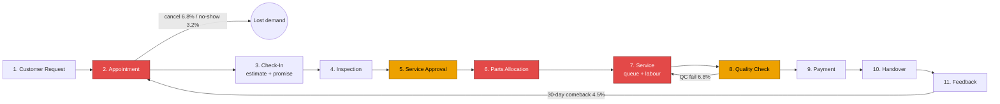

# End-to-End Service Process Map

**Scope:** the customer service journey from request to feedback, mapped to the data the network captures.
**Measured values** come from `process_stage_metrics` and related functions in `src/analysis_metrics.py`
(`reports/analysis_metrics.json`), network-wide for Jan 2025 to Sep 2026 unless stated. "Not captured" means the
dataset has no timestamp or field for that stage. Synthetic data, not affiliated with Ather Energy.

## Workflow

Red = confirmed bottleneck stage (B1-B5). Amber = failure point with measurable impact.

| Bottleneck | Stage(s) |
|---|---|
| B1 Technician capacity | 7. Service (queue + labour) |
| B2 Saturday peak queue | 7. Service (queue) |
| B3 Parts availability | 6. Parts Allocation |
| B4 Skill mix | 7. Service (labour) and 8. Quality Check |
| B5 Booking lead time → cancellations | 2. Appointment |

## Stage detail

| # | Stage | Input | Output | Responsible role | Expected duration / standard | Actual (measured) | Failure points | KPI |
|---|---|---|---|---|---|---|---|---|
| 1 | Customer Request | Service due, fault or OTA prompt | Booking request (app 55%, call centre 21%, web 9%, walk-in 14%) | Customer; call centre / app | Same day | Not captured (request-to-booking time). Walk-in share 14.1%. | Customer cannot get a near-term slot | Booking channel mix |
| 2 | **Appointment** 🔴 | Booking request | Confirmed slot | Service advisor / CRM | Lead time ≤3 days (policy assumption) | Booked (non walk-in) lead time: mean **4.25 days**, median 3. **Mumbai 6.0 days**, 32.1% booked 8+ days ahead. Cancellation **6.8%**, no-show 3.2%. 15+ day bookings cancel **19.2%**. Monday cancellations 8.9%. | Long lead → cancellation (B5); no reconfirmation; OTA-resolved slots not released | Cancellation rate; mean lead time; share of 8+ day bookings |
| 3 | Check-In | Vehicle + booking | Job card, estimate, promised ready time | Service advisor | Arrive on slot; promise = estimate + 1.5 shop h | Arrival vs slot: median **+2.9 min**, p90 +18 min (booked jobs) | Promise ignores day load, parts stock and possible extra scope | Promise accuracy (= on-time %) |
| 4 | Inspection | Vehicle | Diagnosis / scope of work | Technician | Not defined | Duration not captured. Additional work found on **16.9%** of jobs. | Scope found after the quote | Additional-work rate |
| 5 | Service Approval 🟠 | Scope + quote | Customer approval | Service advisor | Before work proceeds | Not captured (no approval timestamp). Jobs with extra work: **95.3%** overrun the estimate (median +70.9%), CSAT **3.56** vs 4.01. | No re-quote or approval recorded; bill shock | Cost overrun rate; approval capture rate (new) |
| 6 | **Parts Allocation** 🔴 | Approved scope | Parts issued to job | Parts controller | From stock immediately | **4.7%** of jobs parts-delayed; wait when delayed: mean **129 h**, median **111 h**. **Kolkata 11.2%**. Motor/controller and dashboard parts ~28% of jobs using them. | Stock-out; no pre-allocation at booking; promise not reset | Parts-delay rate; parts wait hours; fill rate (new) |
| 7 | **Service** (queue + labour) 🔴 | Vehicle, parts, technician | Completed work | Technician / workshop controller | Wait ≤0.5 h (policy assumption); labour = estimate | Wait: mean **1.20 h**, median 0.32 h, p90 1.96 h; 14.1% of jobs wait >1.5 h. **Saturday mean 3.06 h**. Labour: estimate 1.86 h vs actual 2.17 h mean; **69%** of jobs exceed the estimate (+0.31 h); Junior +0.65 h. On days above 100% load on-time ≤61%. 2026 utilisation: Mumbai 125%, Chennai 119%, Delhi 102%. | Overload (B1), Saturday peak (B2), skill-driven overrun (B4) | Utilisation; daily load ratio; wait; duration variance |
| 8 | Quality Check 🟠 | Completed job | Pass, or rework loop | Senior technician / QC | Pass first time | First-pass **93.2%** (Junior 90.6%, Senior 94.8%). Rework time not captured separately. | Junior work without senior sign-off; overloaded days (QC 90.6% when load >160%) | QC first-pass rate |
| 9 | Payment | Final invoice | Payment / warranty or plan claim | Service advisor / cashier | Minutes | Not captured (no payment timestamp). Billing mix: customer-paid 64.8%, service plan 26.5%, warranty 5.0%, rework (no charge) 3.7%. | Invoice above quote (see stage 5) | Revenue, margin by billing type |
| 10 | Handover | Paid, QC-passed vehicle | Vehicle returned | Service advisor | By promised ready time | On-time **73.2%**; when late, median **1.3 h** late (mean 27.3 h, driven by parts waits). Turnaround median **2.57 h**, mean 11.2 h. 8.8% of non-parts jobs carry over to the next day. | Missed promise; no proactive delay update | On-time %; turnaround (mean and median) |
| 11 | Feedback | Completed visit | Rating + category; possible comeback | Customer / CX team | Within 3 days | Response rate **50.6%**; feedback arrives a mean of **1.5 days** after completion. CSAT **4.02** (74.5% ≥4). CSAT% **91%** on-time vs 45% when ≤2 h late. 30-day comeback 4.5% (893 zero-revenue rework visits, ₹13.2 lakh). | Low response; comebacks | CSAT, CSAT%; comeback rate |

## Bottleneck evidence on the map

| Stage | Bottleneck | Outlier | Benchmark |
|---|---|---|---|
| 2 Appointment | B5 Lead time → cancellations | Mumbai lead 6.0 days, cancellation 8.6% | Other centres 3.1 days, 6.4% |
| 6 Parts Allocation | B3 Parts availability | Kolkata 11.2% delayed; delayed jobs 0% on-time, median 116 h | Bengaluru-Whitefield 3.1%; network 4.7% |
| 7 Service (queue) | B1 Capacity | Mumbai / Chennai / Delhi utilisation 125% / 119% / 102% (2026); on-time 62% / 65% / 67% | Pune 65% utilisation, 83% on-time |
| 7 Service (queue) | B2 Saturday peak | Saturday wait 3.06 h, on-time 55% | Tue-Thu 0.56 h, 80% |
| 7 Service + 8 QC | B4 Skill mix | Junior +0.65 h/job, overrun 56%, QC 90.6% | Senior +0.14 h, 27%, 94.8% |

## Data-capture gaps (recommended additions)

To measure every stage, the operational systems should add:

1. A booking request timestamp (stage 1).
2. Inspection start/end and approval timestamps, with an approved-quote value (stages 4-5).
3. Line-level parts request, stock-out flag and receipt time (stage 6).
4. QC result with failure reason and rework time (stage 8).
5. Payment and handover timestamps (stages 9-10).
6. Technician attendance and overtime (stage 7, so that utilisation above 100% can be explained).
