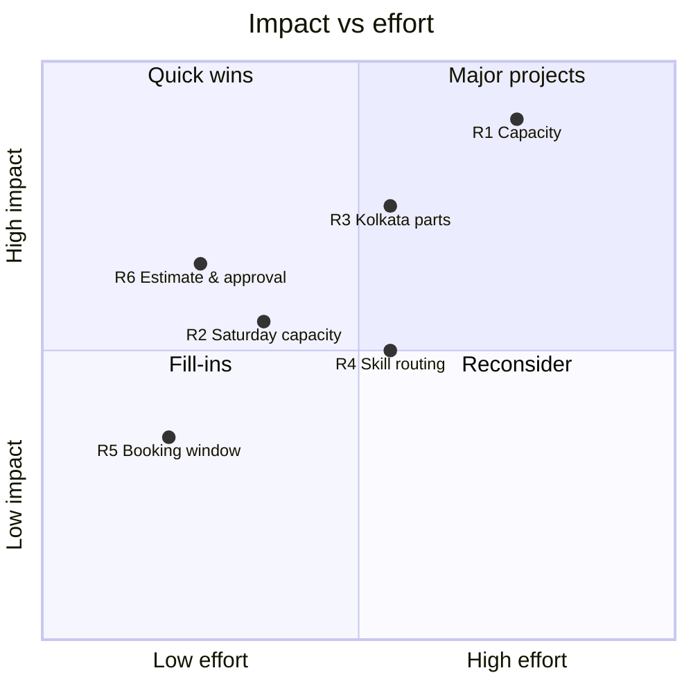

# Recommendations

**Basis:** every recommendation traces to a finding in `docs/findings.md` (F#) and a bottleneck (B#), with root
causes in `docs/root_cause_analysis.md`. Impact numbers come from `impact_estimates()` in
`src/analysis_metrics.py` (`reports/analysis_metrics.json` → `impact`), at the **2026 (Jan-Sep) run-rate**.
Synthetic data, not affiliated with Ather Energy.

**How impact is estimated (applies throughout).** Capacity what-ifs use a deliberately simple model:

* Demand is held at the centre's observed 2026 jobs. No growth and no recovered cancellations are credited.
* Each day's load ratio is scaled by the added capacity.
* The change in on-time is read off the **network on-time-by-load curve** (F3) as a *delta*, so each centre keeps
  its own residual gap (skill, parts). This is conservative.
* Costs use technician `hourly_cost` × 8 shift hours × 26.05 mean working days per month. Overtime is assumed at
  2× hourly cost. Inventory carrying cost is assumed at 20% a year.
* These are planning estimates, not forecasts, and each is to be validated by the pilot KPIs below.

---

## Priority summary and impact × effort

| Priority | Recommendation | Traces to | Impact | Effort | Owner |
|---|---|---|---|---|---|
| 1 | **R1** Add technician capacity at Mumbai (Senior) and Chennai (Mid); utilisation trigger for Delhi | F1, F2, F3 / B1, B4, B5 | High | Medium-High | Regional Service Manager (West, South) + HR |
| 2 | **R3** Kolkata parts: safety stock for high-delay SKUs, parts pre-allocation at booking, parts-aware promise | F5, F6 / B3 | High (Kolkata) | Medium | Parts & Inventory Manager (East) |
| 3 | **R6** Re-quote and approval on extra scope; recalibrate labour standards; reset promise on change | F6, F9 | Medium-High | Low | Service Operations Lead |
| 4 | **R2** Saturday capacity at loaded centres plus targeted weekday shifting | F4 / B2 | Medium | Low-Medium | Centre Managers |
| 5 | **R5** Booking-window controls: reconfirmation, waitlist, slot release | F8 / B5 | Low-Medium | Low | CX / Digital Booking Product Owner |
| 6 | **R4** Skill-based routing, senior QC sign-off, junior certification path | F7 / B4 | Medium | Medium | Technical Training Manager + Centre Managers |

---

## R1. Add technician capacity where utilisation exceeds 100%

* **Problem metric:** 2026 utilisation of 125% at Mumbai, 119% at Chennai and 102% at Delhi; on-time 62% / 65% /
  67% vs 82-83% at benchmarks (F2). On-time falls to ≤61% above 100% daily load (F3). Network jobs +47% YoY on a
  fixed roster (F1).
* **Action:**
  1. **Mumbai:** hire or second **one Senior technician**. This also gives Mumbai its first Senior, addressing B4
     there.
  2. **Chennai:** add **one Mid technician**.
  3. **Delhi:** do not hire yet. Apply R2 and R4, and hire when monthly utilisation exceeds 95% for 2 consecutive
     months.
  4. **Network:** adopt a standing capacity rule. Plan rosters to keep daily load ≤90% and review monthly.
* **Owner:** Regional Service Managers (West, South), with HR. Centre Managers own the daily load KPI.
* **Expected impact (2026 run-rate, what-if model):**

  | Centre | Utilisation now → projected | Overloaded days now → projected | On-time now → projected | Extra on-time jobs/month |
  |---|---|---|---|---|
  | Mumbai (+1) | 124.6% → 83.0% | 38.0% → 14.5% | 54.5% → 74.2% (+19.7 pts) | ≈38 |
  | Chennai (+1) | 118.5% → 79.0% | 48.7% → 14.1% | 56.8% → 80.6% (+23.9 pts) | ≈47 |
  | Delhi (if +1) | 101.5% → 67.7% | 29.2% → 7.7% | 59.4% → 77.8% | ≈30 (deferred: would over-correct) |

  At Mumbai, shortening lead time to the other centres' cancellation level (8.6% → 6.5%) would also recover about
  **4.1 jobs per month** (≈₹12,600 revenue, ₹3,500 profit). Because on-time jobs score CSAT% of 91% vs 45% or
  lower for late jobs (F6), the satisfaction gain is the main benefit.
* **Cost / effort:** Senior about **₹75,000 a month**; Mid about **₹58,300 a month** (gross payroll, an upper
  bound). The Mumbai hire equals 47% of Mumbai's 2026 monthly profit (₹1.60 lakh). **It does not pay for itself
  through recovered bookings.** The case is service level, retention and headroom for growth: Mumbai's jobs grew
  49.5% YoY. Recruitment and onboarding take 6-10 weeks.
* **Risks:**
  * Demand may not keep growing, leaving idle capacity. Mitigation: seconded or contract technician first.
  * A new hire's productivity ramps up slowly.
  * Utilisation above 100% may partly reflect unrecorded overtime. Mitigation: capture attendance first (30-day
    action).
* **Success KPIs:**

  | KPI | Baseline (2026) | Target | Cadence |
  |---|---|---|---|
  | Utilisation per centre | 125% / 119% | 80-90% | Monthly |
  | Share of overloaded days (load >100%) | 38% / 49% | ≤15% | Weekly |
  | On-time % | 54.5% / 56.8% | ≥72% within 90 days of start | Weekly |
  | CSAT% (≥4) | Centre current | +5 pts | Monthly |
  | Mumbai mean booking lead time | 6.0 days | ≤4 days | Monthly |

## R2. Shape Saturday capacity to demand

* **Problem metric:** Saturday carries 23.7% of jobs, 3.06 h mean wait, 54.8% on-time, CSAT 3.78 (F4). In 2026,
  84% of Saturday hours were scheduled bookings.
* **Action:**
  1. Pilot a **+2 hour extended Saturday shift** (or staggered weekday days off) at the four loaded centres:
     Bengaluru-Indiranagar, Chennai, Mumbai and Delhi.
  2. Cap Saturday booking at **90% of capacity** in the app and call-centre script.
  3. Offer flexible customers (fleet, periodic service) **Tue-Thu slots with an incentive**. Use this only at
     centres with weekday headroom (Pune, Hyderabad, Kolkata, Bengaluru-Whitefield). The what-if shows that moving
     15% of Saturday hours at saturated centres lowers Tue-Thu on-time from 75.4% to 72.9%, for a network gain of
     only about 13 on-time jobs per month.
* **Owner:** Centre Managers; Digital Booking Product Owner (cap and incentive).
* **Expected impact:** at the four loaded centres, Saturday on-time rises from **36.7% to 52.7%** (+16 pts),
  about **30 more on-time Saturday jobs per month** (2026 Saturday mean wait there: 5.4 h).
* **Cost / effort:** about **₹45,800 a month** of overtime (9 technicians × 2 h × 2× hourly cost × 4.33
  Saturdays). Low-medium effort: roster change plus booking-rule configuration.
* **Risks:** technician fatigue on extended shifts; customers rejecting weekday slots; overtime rules. Mitigation:
  rotate the extended shift and review after 6 weeks.
* **Success KPIs:**

  | KPI | Baseline | Target | Cadence |
  |---|---|---|---|
  | Saturday mean wait (loaded centres) | 5.4 h | ≤2 h | Weekly |
  | Saturday on-time (loaded centres) | 36.7% | ≥50% | Weekly |
  | Saturday share of bookings at headroom centres | Current | −3 pts | Monthly |
  | Overtime hours per technician | New measure | Within policy | Weekly |

## R3. Fix parts availability at Kolkata; make promises parts-aware

* **Problem metric:** Kolkata parts-delay 11.2% (2026: 10.8%) vs a 3.8% median at other centres. Delayed jobs are
  0% on-time with median turnaround 116 h and CSAT 2.95 (F5, F6). 35.9% of Kolkata's complex repairs are delayed.
  A-class parts with ≥20% delay: P020, P024, P016, P011, P025, P028.
* **Action:**
  1. **Safety stock at Kolkata:** one supplier lead time of 2026 demand for the 34 SKUs whose jobs were delayed on
     ≥10% of Kolkata jobs (minimum 1 unit).
  2. **Parts pre-allocation at booking** for complex service types (motor/controller, charging, electrical,
     accident). Check stock when the appointment is made. If a part is missing, order it and schedule the visit
     for its arrival.
  3. **Parts-aware promise:** if a required part is not in stock at check-in, the promise becomes supplier lead
     time + estimate, and the customer is told immediately. Optionally offer a loaner.
  4. Extend the A-class high-delay list to Delhi (6.0%), the second-worst centre.
* **Owner:** Parts & Inventory Manager (East), with Service Advisors (promise rule).
* **Expected impact (2026):** bringing Kolkata to the other centres' median (3.8%) avoids about **8.7 delayed jobs
  per month**. That gives about **7.2 more on-time jobs per month** and saves about **1,076 customer-hours of
  turnaround per month** (123.6 h per avoided delay). The parts-aware promise turns the remaining delays from
  broken promises into managed expectations. The CSAT link to lateness (F6) suggests this is the larger
  satisfaction lever.
* **Cost / effort:** about **₹1.77 lakh one-off working capital** (34 SKUs). Carrying cost about **₹35,000 a
  year** at an assumed 20%. Medium effort: inventory policy change plus a booking-system stock check.
* **Risks:** obsolete stock for low-volume SKUs (several have only 2-5 Kolkata jobs a year); cash tied up.
  Mitigation: start with the six A-class high-delay SKUs and review monthly turns.
* **Success KPIs:**

  | KPI | Baseline | Target | Cadence |
  |---|---|---|---|
  | Kolkata parts-delay rate | 10.8% | ≤5% in 90 days, ≤3.8% in 6 months | Monthly |
  | Fill rate for A-class SKUs (new) | Not captured | ≥95% | Weekly |
  | Kolkata mean turnaround | 18.7 h | ≤11 h | Monthly |
  | Complex bookings with parts reserved (new) | Not captured | ≥80% | Monthly |

## R4. Deploy skill as a capacity lever

* **Problem metric:** Junior labour +0.65 h per job over estimate (Senior +0.14 h). Overrun rate 55.7% vs 27.5%.
  QC first-pass 90.6% vs 94.8% (F7). Juniors carry 50.5% of Mumbai's and 59.1% of Delhi's jobs.
* **Action:**
  1. **Skill-based routing:** complex service types go to Senior/Master, or to a Junior only with senior oversight.
  2. **Senior QC sign-off** on junior work at Mumbai and Delhi.
  3. **Certification path** (EV Level 1 → 2) with targets on labour variance and QC first-pass.
  4. **Standard work** for the job types with the largest overruns.
* **Owner:** Technical Training Manager, with Centre Managers.
* **Expected impact:** if junior labour variance reaches the Mid level (+0.35 h), about **113 labour hours per
  month** are released (≈0.6 of a technician). This is roughly the gap between Delhi's 102% utilisation and
  safety. About **9 fewer QC failures per month**. Rework-cost avoidance is small (~₹1,600 a month), because
  comebacks differ little by skill once job mix is controlled.
* **Cost / effort:** training time and senior mentoring hours (not in the data). Medium effort, with a 3-6 month
  payoff.
* **Risks:** senior time diverted from jobs while capacity is already short. Sequence after R1 at Mumbai. Junior
  attrition after certification.
* **Success KPIs:**

  | KPI | Baseline | Target | Cadence |
  |---|---|---|---|
  | Junior labour variance (h per job) | +0.65 h | ≤+0.40 h in 6 months | Monthly |
  | Junior QC first-pass | 90.6% | ≥93% | Monthly |
  | Cost-overrun rate, no-extra-scope jobs (Mumbai / Delhi) | 37.9% / 31.8% | ≤25% | Monthly |

## R5. Booking-window controls

* **Problem metric:** cancellation of 8-14 day bookings 11.7% and 15+ day bookings 19.2%, vs 6.4% at 1-3 days.
  Mumbai: 32.1% of bookings 8+ days ahead and 8.6% cancellation. Monday cancellations 8.9%. Software-update
  bookings cancel 10.7% (F8).
* **Action:**
  1. **T−2 day reconfirmation** (app push, SMS or call) for bookings made 8+ days ahead and for all Monday slots.
  2. **Waitlist and earlier-slot offers** when a slot frees up.
  3. **Auto-release** of cancelled and OTA-resolved slots.
  4. At Mumbai, show the next available date honestly and offer the nearest centre with capacity.
* **Owner:** CX / Digital Booking Product Owner.
* **Expected impact:** bringing 8+ day bookings to the 4-7 day cancellation rate (8.6%) recovers about **6.6 jobs
  per month network-wide** (≈₹21,000 revenue, ≈₹5,200 profit per month). Freed slots also ease the capacity
  pressure in B1.
* **Cost / effort:** low (configuration plus messaging).
* **Risks:** reminder fatigue; over-booking if released slots are not tracked.
* **Success KPIs:**

  | KPI | Baseline | Target | Cadence |
  |---|---|---|---|
  | Cancellation rate, 8+ day bookings | 12.6% (2026) | ≤9% | Monthly |
  | Monday cancellation rate | 8.9% | ≤7% | Monthly |
  | Mumbai cancellation rate | 8.6% | ≤6.5% | Monthly |
  | Released slots re-booked (new) | Not captured | ≥60% | Weekly |

## R6. Estimate, approval and promise discipline

* **Problem metric:** 17.3% of jobs find additional work; 95.3% of these overrun the estimate (median +70.9%) and
  their CSAT is 3.65 vs 4.10. 69% of all jobs exceed the labour estimate (+0.31 h mean). Lateness is the strongest
  correlate of low ratings: CSAT% 91% on time vs 45% when ≤2 h late (F6, F9).
* **Action:**
  1. **Mandatory digital re-quote and customer approval** before additional work proceeds, recorded with a
     timestamp and approved amount.
  2. **Recalibrate standard labour times** quarterly from actual hours by service type.
  3. **Reset the promised time** whenever scope or parts change, and notify the customer proactively.
* **Owner:** Service Operations Lead, with Service Advisors.
* **Expected impact:** not monetised; the dataset has no approval or price-sensitivity data. Expected effects:
  fewer unapproved overruns, fewer "late" outcomes caused by an unrealistic promise rather than a slow job, and
  CSAT on additional-work jobs closer to the 4.0 baseline.
* **Cost / effort:** low (process plus job-card change).
* **Risks:** longer advisor time per job; customers declining extra work (a safety issue for brake and electrical
  faults). Mitigation: a safety-critical approval script.
* **Success KPIs:**

  | KPI | Baseline | Target | Cadence |
  |---|---|---|---|
  | Extra-scope jobs with recorded approval (new) | Not captured | 100% | Weekly |
  | Cost-overrun rate, jobs without approved extra scope | 25.1% | ≤15% | Monthly |
  | Share of jobs exceeding the labour estimate | 69% | ≤55% | Quarterly |
  | CSAT on additional-work jobs | 3.65 | ≥3.9 | Monthly |

---

## 30/60/90-day implementation roadmap

| Window | Actions | Exit criteria |
|---|---|---|
| **Days 0-30: stabilise and measure** | **R1:** approve the Mumbai Senior and Chennai Mid positions; second a technician to Mumbai temporarily. **R2:** start the Saturday +2 h pilot at Mumbai and Chennai. **R5:** turn on T−2 reconfirmation and slot auto-release. **R6:** introduce the approval step on job cards. **Data:** start capturing attendance/overtime, approval timestamps and line-level stock-outs. Publish a weekly KPI pack. | Weekly KPI pack live; pilots running; baselines frozen |
| **Days 31-60: fix supply and spread** | **R3:** place the Kolkata safety-stock order (six A-class SKUs first) and switch on the stock check at booking for complex jobs; apply the parts-aware promise rule. **R2:** extend the pilot to Bengaluru-Indiranagar and Delhi; launch the weekday incentive at headroom centres. **R4:** start skill-based routing and senior QC sign-off at Delhi. **R1:** onboard the new hires. | Kolkata fill rate ≥90% on A-class SKUs; Saturday wait trending down at pilot centres |
| **Days 61-90: embed and evaluate** | **R1:** assess Mumbai and Chennai against the targets (on-time ≥72%, overloaded days ≤15%); decide on Delhi using the 95% utilisation trigger. **R6:** first labour-standard recalibration. **R3:** extend to the remaining SKUs and Delhi if the pilot meets target. **R4:** junior certification plans in place. Management review of all KPIs against targets. | Go/no-go per recommendation; targets reset for the next quarter |

## How management measures success

* **Weekly operations pack** (centre managers): on-time %, overloaded-day share, Saturday wait, parts-delay rate,
  cancellation rate. Flag any centre with daily load above 90% for 3 or more days in a week.
* **Monthly business review** (regional managers): utilisation by centre and technician, CSAT%, cost-overrun rate,
  Kolkata turnaround, junior labour variance, revenue and margin. Compare against the targets above and the 2026
  baseline.
* **Quarterly:** labour-standard recalibration, a capacity plan refresh against demand growth, and the ABC
  re-classification of parts.
* **Evaluation design:** pilots run at named centres with the remaining centres as comparison, so improvements
  can be attributed more credibly than with a before/after comparison alone. This is how each root-cause
  hypothesis is confirmed or rejected.
