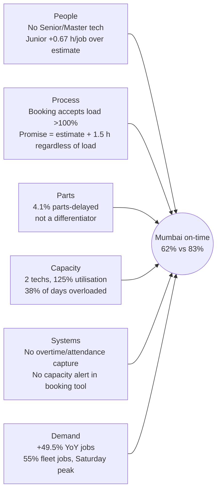

# Root Cause Analysis

**Scope:** the five bottlenecks identified in `docs/findings.md` (B1-B5).
**Method:** for each bottleneck: a problem statement, 5 Whys, a fishbone across six cause categories (People,
Process, Parts, Capacity, Systems, Demand), a comparison with better-performing centres, and the hypotheses with
the operational data that would confirm or reject them.
**Evidence source:** `python -m src.analysis_metrics` (`reports/analysis_metrics.json`) and
`notebooks/03_exploratory_analysis.ipynb`. Synthetic data, not affiliated with Ather Energy.

> **Causality statement.** The data shows *associations*. The "whys" below are the most consistent explanation of
> the evidence, and each is labelled as a hypothesis. A root cause is accepted only after the confirming data in
> each section has been collected (usually a 4-8 week operational check or pilot).

---

## Comparison basis: struggling vs benchmark centres

| Dimension | Mumbai - Andheri | Chennai - Anna Nagar | Delhi - Saket | Kolkata - Salt Lake | Pune - Baner (benchmark) | Hyderabad - Gachibowli (benchmark) |
|---|---|---|---|---|---|---|
| **Outcome:** on-time | 62.2% | 65.4% | 67.5% | 77.8% | 83.1% | 81.5% |
| Mean / median turnaround | 11.2 h / 2.94 h | 12.0 h / 2.78 h | 13.5 h / 2.75 h | **18.7 h** / 2.34 h | 9.7 h / 2.25 h | 9.6 h / 2.40 h |
| CSAT | 3.86 | 3.89 | 3.94 | 4.05 | 4.14 | 4.14 |
| **Workload:** utilisation 2026 | **124.6%** | **118.5%** | **101.5%** | 67.2% | 65.3% | 75.6% |
| Overloaded days 2026 | 38.0% | **48.7%** | 29.2% | 14.2% | 16.5% | 15.5% |
| Jobs per technician per month 2026 | 95 | 99 | 82 | 62 | 63 | 64 |
| **Staffing:** technicians (Senior+Master) | 2 (**0**) | 2 (1) | 2 (1) | 2 (2) | 2 (2) | 2 (1) |
| Junior share of jobs | 50.5% | 0% | **59.1%** | 0% | 0% | 0% |
| **Parts:** parts-delay rate | 4.1% | 4.3% | 6.0% | **11.2%** | 4.3% | 3.6% |
| **Service mix:** complex-job share | 10.8% | 11.5% | 12.0% | 12.2% | 11.5% | 11.7% |
| Periodic-service share | 59.5% | 58.9% | 57.8% | 58.1% | 60.6% | 58.8% |
| Fleet share of jobs | 55.3% | 56.1% | 51.9% | 40.8% | 44.0% | 31.1% |
| **Booking:** mean lead time / cancellation | **6.0 days / 8.6%** | 3.1 / 6.4% | 3.3 / 6.2% | 3.0 / 6.4% | 3.1 / 6.2% | 3.1 / 6.5% |

**Reading the comparison.** Service mix is almost identical across centres, so it does **not** explain the
performance gaps. What differs is **workload per technician** (95-99 jobs per technician per month at Mumbai and
Chennai vs 62-64 at the benchmarks), **staffing skill** (Mumbai and Delhi) and **parts availability** (Kolkata).

---

## B1. Technician capacity: Mumbai, Chennai, Delhi

**Problem statement.** In Jan-Sep 2026 Mumbai's technicians logged 125% of their rostered productive hours.
Chennai logged 119% and Delhi 102%. These centres complete 62%, 65% and 67% of jobs on time, against 82-83% at
Pune and Hyderabad. Above 100% daily load, the network on-time rate falls to 61% or lower.

### 5 Whys (Mumbai)

| # | Why? | Evidence |
|---|---|---|
| 1 | Why is Mumbai's on-time rate 62% vs 83% at Pune? | Jobs wait longer to start (mean 1.84 h vs 0.96 h) and more carry over to the next day (12.8% vs 6.2% of non-parts jobs). Only 29% of carried-over jobs are on time. |
| 2 | Why do jobs wait and carry over? | Booked work exceeded rostered capacity on 38% of working days in 2026 (Pune 16.5%). Above 100% load, on-time falls to 61% or below (F3). |
| 3 | Why is booked work above capacity? | Mumbai's Jan-Sep jobs grew 49.5% (1,147 → 1,715) with the roster unchanged at 2 technicians, giving 95 jobs per technician per month vs 63 at Pune. |
| 4 | Why does the roster deliver less than its nominal hours? | It is one Junior and one Mid. Labour runs +0.67 h (T013) and +0.36 h (T014) per job over estimate, so effective capacity is below the 2 × 7 h the booking plan assumes. |
| 5 | Why was capacity not added as demand grew? | *Hypothesis:* there is no utilisation or overload trigger in capacity planning. The booking calendar absorbs excess demand by pushing lead time out (6.0 days) rather than flagging a staffing gap. |

**Likely root cause (hypothesis):** the roster was sized for 2025 demand, there is no capacity-planning trigger,
and the low-skill mix reduces effective hours.

### Fishbone (Mumbai on-time 62%)

| Category | Contributing factor | Evidence strength |
|---|---|---|
| People | No Senior/Master technician; Junior labour overrun +0.67 h per job | Strong (data) |
| Process | Slots accepted beyond capacity; promise time ignores the day's load | Strong (load-curve data) / Hypothesis (policy) |
| Parts | Parts-delay 4.1%, in line with the network | Ruled out as primary |
| Capacity | 125% utilisation; 95 jobs per technician per month | Strong |
| Systems | No overtime or attendance data; no capacity alert | Hypothesis |
| Demand | +49.5% YoY; high fleet share; Saturday 24% of jobs | Strong |

**Chennai and Delhi.** Chennai has the same capacity signature: 119% utilisation, 49% of days overloaded, 99 jobs
per technician per month, but a Mid + Senior roster. That points to volume alone. Delhi (102%) combines moderate
overload with a junior carrying 59% of jobs and the second-highest parts-delay rate (6.0%).

### Hypotheses and confirming data

| Hypothesis | Data that would confirm or reject it |
|---|---|
| H1.1 Overload, not slow work, drives Mumbai's lateness | Daily technician clock-in/out and overtime logs. Re-run the load curve using actual attended hours. |
| H1.2 Adding capacity restores on-time to ~74% | Pilot: third technician (or a seconded senior) for 8 weeks. Track daily load ratio and on-time weekly against the what-if projection. |
| H1.3 Booking tool does not cap load | Booking-system configuration audit; share of slots booked on days already above 90% load. |
| H1.4 Fleet bookings bunch on specific days | Fleet booking calendar by account; fleet share of overloaded days. |

---

## B2. Saturday peak-day queue

**Problem statement.** Saturday carries 23.7% of jobs with the same roster as a weekday. Mean wait is 3.06 h
(Tue-Thu 0.56 h), on-time is 54.8% (Tue-Thu 80.0%), CSAT is 3.78, and 15.8% of non-parts jobs carry over the
Sunday closure.

### 5 Whys

| # | Why? | Evidence |
|---|---|---|
| 1 | Why is Saturday on-time 55%? | Mean wait 3.06 h before work starts, versus 0.49-0.74 h on weekdays. |
| 2 | Why is the wait so long? | Saturday demand is about 1.6× a weekday's on the same roster, so the day sits far up the load curve. |
| 3 | Why is demand concentrated on Saturday? | Individual owners prefer non-working days. 84% of Saturday hours in 2026 were scheduled bookings, so the system is accepting the peak. |
| 4 | Why does the booking system accept it? | *Hypothesis:* slots are offered on a uniform template with no Saturday cap and no incentive to move flexible work (fleet, periodic) to weekdays. |
| 5 | Why is roster supply not shaped to demand? | *Hypothesis:* Saturday staffing equals weekday staffing (no extended shift or staggered weekday off), because rostering is not driven by forecast load. |

### Fishbone

| People | Process | Parts | Capacity | Systems | Demand |
|---|---|---|---|---|---|
| Same headcount every day | No Saturday booking cap; uniform slot template | Not a driver (Saturday parts-delay similar) | Saturday capacity = weekday capacity | No demand-based rostering; no "move to weekday" nudge in the app | 1.6× weekday demand; owners' preference for weekends |

### Comparison
Every centre has the Saturday peak, but the impact scales with weekday headroom. In 2026, at the four most loaded
centres (Bengaluru-Indiranagar, Chennai, Mumbai, Delhi), Saturday on-time was **36.7%** with a **5.4 h** mean
wait. Centres with weekday headroom (Pune, Hyderabad, Kolkata) can absorb shifted demand; the loaded centres
cannot (the what-if shows Tue-Thu on-time falling from 75.4% to 72.9% if 15% of Saturday hours are moved to
already-busy weekdays).

### Hypotheses and confirming data

| Hypothesis | Data that would confirm or reject it |
|---|---|
| H2.1 Saturday demand is partly flexible (fleet, periodic) | Saturday bookings by customer type and service type; uptake test of a weekday incentive in the app. |
| H2.2 Extra Saturday hours restore service | 6-week pilot of a +2 h Saturday shift at two centres; compare Saturday wait and on-time with control centres. |
| H2.3 Carry-over to Monday drives low Saturday CSAT | Rating of Saturday jobs completed same day vs Monday. |

---

## B3. Parts availability: Kolkata, and motor/controller and dashboard parts

**Problem statement.** 4.7% of jobs (1,134) waited for parts. None of them met the promised time, their median
turnaround was 116 h (vs 2.5 h), and their CSAT was 2.95 (vs 4.08). Kolkata's parts-delay rate is 11.2% (2026:
10.8%) against 3.1-4.3% at most centres. Kolkata has the highest delay in every category, and 35.9% of its
complex repairs are parts-delayed.

### 5 Whys (Kolkata)

| # | Why? | Evidence |
|---|---|---|
| 1 | Why is Kolkata's mean turnaround the highest (18.7 h) when its median (2.34 h) and utilisation (67%) are normal? | 11.2% of its jobs wait for parts, a mean of 131 h each. |
| 2 | Why are so many jobs waiting for parts? | Required parts are not on the shelf. The delay rate is 2-3× the network in every category (motor & controller 54%, dashboard 56%, body 47%). |
| 3 | Why are parts missing in every category, not one? | *Hypothesis:* a location-wide supply issue (distance from the parts hub, replenishment frequency) rather than a single SKU forecasting error. |
| 4 | Why is stock not held locally to cover the longer supply chain? | *Hypothesis:* stocking levels follow a network-standard policy that does not scale with replenishment lead time to the East region. |
| 5 | Why does a stock-out always become a broken promise? | The promise time (estimate + 1.5 h) is set at check-in without checking parts availability. Parts are not pre-allocated at booking even for complex repairs. |

### Fishbone

| People | Process | Parts | Capacity | Systems | Demand |
|---|---|---|---|---|---|
| Service advisor promises time without a stock check | No parts pre-allocation at booking for complex jobs; promise ignores supplier lead time | Low local stock of A-class high-delay SKUs (P020, P024, P016, P011, P025, P028); 7-18 day supplier lead times | Not a driver (67% utilisation) | Stock visibility not linked to booking; job-level (not part-line) delay recording | Complex-repair share 12.2%, similar to network |

### Comparison
Bengaluru-Whitefield (3.1%) and Hyderabad (3.6%) see the same service mix with far fewer delays. Delhi (6.0%) is
second worst, consistent with the same supply-distance pattern. Parts delays are **not** linked to centre load:
Kolkata is one of the least loaded centres.

### Hypotheses and confirming data

| Hypothesis | Data that would confirm or reject it |
|---|---|
| H3.1 Kolkata's delays are stock-level, not supplier-performance, driven | Line-level stock-out log (which part, on-hand quantity at request, PO date, receipt date); supplier on-time-in-full for East-region deliveries. |
| H3.2 One lead time of local cover for high-delay SKUs halves delays | 3-month pilot of safety stock for the 34 identified SKUs; track parts-delay rate monthly. |
| H3.3 Pre-allocating parts at booking removes most complex-job delays | Share of complex bookings with parts reserved before arrival; delay rate of reserved vs non-reserved jobs. |

---

## B4. Skill mix: labour overruns and first-time quality

**Problem statement.** Junior technicians run +0.65 h per job over the labour estimate (Senior +0.14 h), overrun
the cost estimate on 55.7% of jobs (Senior 27.5%) and pass QC first time 90.6% of the time (Senior 94.8%). On
complex jobs the gap widens: +1.09 h vs +0.25 h, and 87.3% vs 92.4% QC first-pass. Juniors carry 50.5% of
Mumbai's jobs and 59.1% of Delhi's.

### 5 Whys

| # | Why? | Evidence |
|---|---|---|
| 1 | Why do Mumbai and Delhi overrun estimates most (37.9% and 31.8% overrun on jobs with no extra scope; Pune 9.5%)? | Over half their jobs are done by juniors, who exceed the labour estimate most. |
| 2 | Why do juniors exceed the estimate? | The estimates are skill-neutral standard times; junior hours on a job are about 1.2× a senior's. |
| 3 | Why are juniors doing complex work at all? | Mumbai has no Senior or Master, so 31.9% of its complex jobs go to the junior (network 5% of junior work is complex). |
| 4 | Why is first-pass QC lower? | *Hypothesis:* limited supervision; no senior sign-off on junior work at centres without a senior. |
| 5 | Why has this persisted? | *Hypothesis:* no skill-based routing rule and no structured progression (EV Level 1 → 2) tied to measured labour variance or QC. |

### Fishbone

| People | Process | Parts | Capacity | Systems | Demand |
|---|---|---|---|---|---|
| Junior-heavy rosters at Mumbai and Delhi; no Senior at Mumbai | Skill-neutral standard times; no skill-based routing; no senior QC sign-off | Additional parts found mid-job lengthen junior jobs | Overload leaves no time for coaching | Technician-level labour variance not reported to managers | Rising complex-repair volume as the fleet ages |

### Comparison
Pune (Senior + Master): +0.04 h average labour variance and the best QC (95.6%). Chennai (Mid + Senior) is just
as overloaded as Mumbai but overruns cost estimates less often (33.6% vs 47.6%).

### Hypotheses and confirming data

| Hypothesis | Data that would confirm or reject it |
|---|---|
| H4.1 Skill, not job allocation, drives the labour gap | Within-job-type comparison over time as juniors are certified; matched comparisons on identical service codes. |
| H4.2 Senior sign-off lifts junior QC first-pass | QC failure reason codes; before/after pilot at Delhi. |
| H4.3 Skill-based routing reduces overload | Daily routing logs; labour variance per job type and technician. |

---

## B5. Booking lead time and cancellations (Mumbai)

**Problem statement.** Mumbai's mean booking lead time is 6.0 days (other centres about 3.1), and 32.1% of its
bookings are made 8 or more days ahead (network 11.9%). Its cancellation rate is 8.6% (other centres' median
6.4%), and "Long Wait for Slot" is 29% of its cancellations. Across the network, cancellation rises from 6.4%
(1-3 days) to 19.2% (15+ days).

### 5 Whys

| # | Why? | Evidence |
|---|---|---|
| 1 | Why does Mumbai lose more appointments? | Highest cancellation rate (8.6%), with the highest share of "Long Wait for Slot". |
| 2 | Why do customers cancel? | They booked far ahead: 15+ day bookings cancel 19.2% of the time, 8-14 day bookings 11.7%. |
| 3 | Why are they booking so far ahead? | The next available slot is days away because capacity is saturated (B1). |
| 4 | Why is a far-out booking not retained? | *Hypothesis:* no reconfirmation or earlier-slot offer, and no waitlist. Customers find alternatives ("Visited Another Workshop" is 13% of Mumbai's cancellations). |
| 5 | Why are freed slots not reused? | *Hypothesis:* cancelled and OTA-resolved slots are not released back to the waitlist in real time. |

### Fishbone

| People | Process | Parts | Capacity | Systems | Demand |
|---|---|---|---|---|---|
| No call-back on long-lead bookings | No reconfirmation at T−2 days; no waitlist; Monday slots booked before the weekend without reminder | Not a driver | Saturated calendar (125% utilisation) pushes lead time out | App does not offer earlier slots or release cancelled slots automatically | +49.5% YoY volume; Monday cancellations 8.9% network-wide |

### Hypotheses and confirming data

| Hypothesis | Data that would confirm or reject it |
|---|---|
| H5.1 Lead time, not customer type, drives the cancellation gap | Cancellation by lead band within customer type and channel (logistic model on booking logs). |
| H5.2 Reconfirmation reduces long-lead cancellations | A/B test of a T−2 day reconfirmation and earlier-slot message in the app. |
| H5.3 Adding capacity (R1) shortens Mumbai's lead time | Mean lead time and share of 8+ day bookings, tracked weekly after R1. |

---

## Cross-cutting root causes

1. **Capacity planning is not linked to load** (B1, B2, B5): no utilisation or overload trigger, and no
   demand-shaped rostering.
2. **Promise and estimate rules are static** (B1, B3, F9): promised time ignores daily load, parts availability
   and newly found scope, so avoidable broken promises follow.
3. **Parts supply is not differentiated by location** (B3).
4. **Skill deployment is not managed as a capacity lever** (B4).

These map directly to recommendations R1-R6 in `docs/recommendations.md`.
