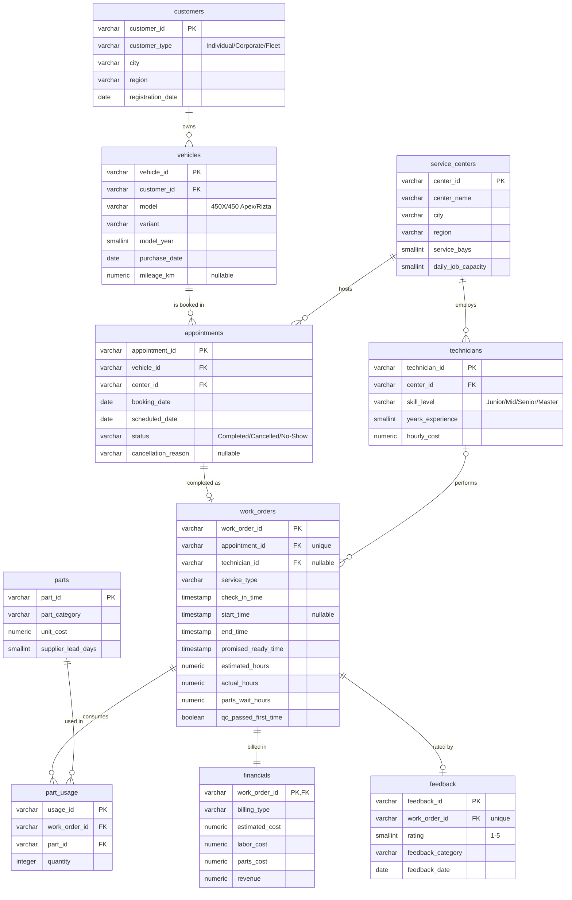

# SQL / database layer

PostgreSQL 16 database (`service_ops` schema) holding the 10 cleaned, normalised tables, a set of KPI views,
a SQL data-quality suite and 21 business queries. Synthetic data only (EV two-wheeler service network modelled on
Ather-style models, 8 Indian centres, Jan 2025 - Sep 2026, INR). Not affiliated with Ather Energy.

## 1. Start the database

Credentials live in `.env` (gitignored). Copy `.env.example` to `.env` and set a local password:

```
POSTGRES_HOST=localhost
POSTGRES_PORT=5432
POSTGRES_DB=vehicle_service
POSTGRES_USER=analyst
POSTGRES_PASSWORD=<choose-a-local-password>
```

```bash
docker compose up -d                      # postgres:16-alpine, container vso_postgres, named volume vso_pgdata
docker inspect -f '{{.State.Health.Status}}' vso_postgres   # wait for "healthy"
```

Change `POSTGRES_PORT` in `.env` if 5432 is already in use on your machine.

## 2. Load the data and create the views

```bash
python -m src.load_to_db                  # schema.sql -> COPY 10 CSVs in FK order -> views.sql -> row-count check
python -m src.load_to_db --no-views       # tables only
```

The run is one transaction and idempotent: it drops and recreates the `service_ops` schema each time.
The loader reads `data/cleaned/*.csv` (run `python -m src.data_cleaning` first if they are missing) and exits non-zero
if any table's row count differs from its CSV.

## 3. Run the reports

```bash
python -m src.run_sql_reports             # executes sql/kpi_queries.sql + sql/data_quality.sql
```

Output goes to `reports/sql_results/`: one `Qxx_<slug>.csv` per business query, `SQL_DQ_all_checks.csv` and
`SQL-DQ99_data_quality_summary.csv` for the data-quality suite, and a `README.md` with row counts and first rows.

Ad-hoc use: `docker exec -it vso_postgres psql -U analyst -d vehicle_service` then `SET search_path TO service_ops, public;`.

## Files

| File | Purpose |
|---|---|
| `schema.sql` | Idempotent DDL: tables, PKs, FKs, CHECK constraints, indexes, table comments |
| `views.sql` | Reusable KPI views (created after the load) |
| `data_quality.sql` | 50 labelled validation queries + `SQL-DQ99` UNION ALL summary (mirrors spec section 7) |
| `kpi_queries.sql` | 21 business queries `Q01`-`Q21`, each with a business-question header |
| `../docker-compose.yml` | PostgreSQL service definition |
| `../src/db.py`, `../src/load_to_db.py`, `../src/run_sql_reports.py` | Connection helper, loader, report runner |

## ER diagram



## Views

Ratios in views are fractions (0-1); multiply by 100 for percentages. KPI numbers refer to the 16-KPI framework.

| View | Grain | Contents |
|---|---|---|
| `vw_period_calendar` | 1 row | Period start/end, Mon-Sat working days, 7 productive hours/day (KPI 9 denominator) |
| `vw_work_order_enriched` | work order | All joins plus wait, turnaround, late hours, on-time flag, duration/cost variance, profit, overrun flag, comeback flags (LAG/LEAD), visit number |
| `vw_appointment_enriched` | appointment | Centre/customer/model, lead days, lead-time band, weekday, status flags |
| `vw_monthly_financials` | month | Revenue, cost, profit, margin, MoM growth, on-time, turnaround, rating |
| `vw_technician_utilisation` | technician | Jobs, hours, utilisation, on-time, QC first pass, comebacks caused, rating |
| `vw_center_performance` | centre | Full scorecard: money, turnaround, on-time, quality, cancellation, utilisation |
| `vw_service_type_performance` | service type | Volume, financials, timing, variance, quality, rating |
| `vw_appointment_funnel` | month x centre | Completed / cancelled / no-show counts and rates |
| `vw_customer_repeat` | customer (>= 1 completed job) | Visits, revenue, rating, repeat flag |
| `vw_kpi_summary` | 1 row | Headline value of all 16 KPIs |

### KPI definitions used (identical to the Python pipeline)

1. Total revenue = SUM(revenue). 2. Total cost = SUM(labor_cost + parts_cost). 3. Profit = revenue - total cost; margin = profit / revenue.
4. Average service cost = total cost / completed work orders. 5. On-time % = work orders with `end_time <= promised_ready_time` / work orders.
6. Turnaround = `end_time - check_in_time` in hours (mean and median). 7. Cost variance = total cost - estimated cost; overrun = variance > 10% of estimate.
8. Cancellation rate = Cancelled / all appointments (No-Show separate). 9. Utilisation = SUM(actual_hours) / (Mon-Sat days in period x 7 h) per technician; centre = hours / (technicians x days x 7).
10. Satisfaction = AVG(rating); CSAT = share of ratings >= 4. 11. Repeat visit rate = customers with >= 2 completed work orders / customers with >= 1.
12. Comeback rate = work orders followed by another job on the same vehicle and service type checking in within 30 days of their `end_time` / work orders.
13. Duration variance = actual - estimated hours. 14. Parts delay rate = share with `parts_wait_hours > 0`. 15. First-time QC pass = AVG(`qc_passed_first_time`). 16. Wait = `start_time - check_in_time`.

Work orders with no technician are excluded from technician KPIs only; work orders with no `start_time` (23) are excluded from the wait KPI only.

## Business queries (`kpi_queries.sql`)

| ID | Question | Techniques |
|---|---|---|
| Q01 | Headline KPI scorecard (16 KPIs) | view, LATERAL VALUES |
| Q02 | Monthly revenue, cost, profit and MoM growth | DATE_TRUNC, LAG, running SUM |
| Q03 | Turnaround time by centre (mean, median, P90) | INNER JOIN, PERCENTILE_CONT, RANK |
| Q04 | On-time rate by centre with network total | ROLLUP, FILTER |
| Q05 | Technician workload, RANK / DENSE_RANK within centre | LEFT JOIN, window ranks |
| Q06 | Top service types by revenue and profit | RANK, cumulative share |
| Q07 | Cancellation and no-show rate by centre | LEFT JOIN, conditional counts |
| Q08 | Cancellation rate by lead-time band | CASE |
| Q09 | Customer rating by service type | LEFT JOIN, CSAT |
| Q10 | Highest-cost part categories (Pareto) | part_usage / parts / work_orders joins |
| Q11 | Estimated vs actual duration variance | CASE classification |
| Q12 | Repeat-visit rate by customer type | ROLLUP |
| Q13 | YoY comparison, Jan-Sep 2025 vs 2026 | EXTRACT, LATERAL unpivot |
| Q14 | Centre ranking, quartiles and performance category | PERCENT_RANK, NTILE, CASE |
| Q15 | Parts-delay impact on on-time rate and rating | CASE bands, FIRST_VALUE |
| Q16 | Technician skill level vs comeback rate | INNER JOIN, CASE sort |
| Q17 | Weekday load vs wait time | EXTRACT(ISODOW), CORR |
| Q18 | Cost variance by service and billing type | GROUPING SETS |
| Q19 | Vehicle model profile incl. never-serviced vehicles | LEFT JOIN anti-count |
| Q20 | Centre utilisation by month, 3-month moving average | generate_series, window frame |
| Q21 | Customer revenue concentration by decile | NTILE |

## Data-quality checks (`data_quality.sql`)

50 queries (`SQL-DQ01`-`SQL-DQ50`; the `SQL-` prefix avoids clashing with the Python cleaning rules DQ01-DQ20 in `reports/cleaning_log.csv`) each returning `(check_id, check_name, check_type, issue_count)`; `SQL-DQ99` unions them and adds
a PASS / INFO / FAIL status. `integrity` checks must be 0 on the cleaned data. `informational` checks are documented gaps:

| Check | Count | Meaning |
|---|---:|---|
| SQL-DQ43 parts cost reconciliation | 114 | `financials.parts_cost` differs from `part_usage x unit_cost` by > INR 1. Financials are the billing system of record; matches Python cleaning rule DQ19. |
| SQL-DQ46 no technician | 72 | Unassigned/invalid technician; kept for financial KPIs, excluded from technician KPIs. |
| SQL-DQ47 no start time | 23 | Excluded from wait-time KPI. |
| SQL-DQ48 unknown mileage | 15 | Implausible mileage nulled during cleaning. |
| SQL-DQ50 no feedback | 11,906 | Only about half of jobs are rated; rating KPIs use rated jobs only. |

## Governance

Synthetic data, no PII. Credentials come only from environment variables (`.env`, never committed); the loader fails
fast with a clear message if any `POSTGRES_*` variable is missing.
